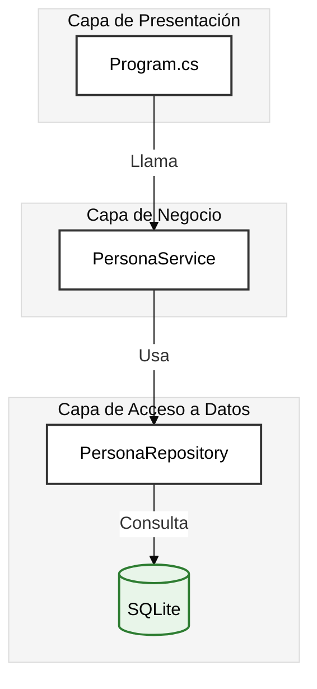

- [6. Repositorios con ADO.NET](#6-repositorios-con-adonet)
  - [6.1. El Patrón Repository](#61-el-patrón-repository)
    - [6.1.1. ¿Qué es un Repositorio?](#611-qué-es-un-repositorio)
    - [6.1.2. Diagrama de Arquitectura](#612-diagrama-de-arquitectura)
    - [6.1.3. ¿Por qué usar el Patrón Repository?](#613-por-qué-usar-el-patrón-repository)
  - [6.2. Interfaz ICrudRepository](#62-interfaz-icrudrepository)
    - [6.2.1. Definición de la Interfaz](#621-definición-de-la-interfaz)
    - [6.2.2. Explicación de cada Método](#622-explicación-de-cada-método)
  - [6.3. Implementación con Clave Autonumérica](#63-implementación-con-clave-autonumérica)
    - [6.3.1. La Entidad Persona](#631-la-entidad-persona)
    - [6.3.2. Tabla en SQLite](#632-tabla-en-sqlite)
    - [6.3.3. El Repositorio Completo](#633-el-repositorio-completo)
    - [6.3.4. Recuperar el ID Generado](#634-recuperar-el-id-generado)
    - [6.3.5. Auto-increment en Diferentes Bases de Datos](#635-auto-increment-en-diferentes-bases-de-datos)
  - [6.4. Implementación con Clave GUID](#64-implementación-con-clave-guid)
    - [6.4.1. ¿Qué es un GUID?](#641-qué-es-un-guid)
    - [6.4.2. Tabla en SQLite para GUID](#642-tabla-en-sqlite-para-guid)
    - [6.4.3. El Repositorio con GUID](#643-el-repositorio-con-guid)
  - [6.5. Ejemplo de Uso](#65-ejemplo-de-uso)
    - [6.5.1. Instalación de Paquetes](#651-instalación-de-paquetes)
    - [6.5.2. Crear la Tabla](#652-crear-la-tabla)
    - [6.5.3. Operaciones CRUD](#653-operaciones-crud)
  - [6.6. Resumen](#66-resumen)

# 6. Repositorios con ADO.NET

## 6.1. El Patrón Repository

### 6.1.1. ¿Qué es un Repositorio?

El **Patrón Repository** es un patrón de diseño que actúa como una **capa de abstracción** entre la lógica de negocio y el acceso a datos. Imagínalo como una **bibliotecario** que gestiona los libros (datos) mientras tú solo le pides lo que necesitas sin preocuparte de dónde está guardado ni cómo se Retrieves.

> 📝 **Nota del Profesor**: El repositorio es el intermediario entre tu código y la base de datos. Tu servicio no sabe si los datos vienen de SQLite, SQL Server, un archivo JSON o incluso de memoria. Esta es la magia de la abstracción.

**Analogía Visual:**

```
┌─────────────────────────────────────────────────────────┐
│                    TU CÓDIGO (Servicio)                 │
│                                                         │
│   "Dame todos los estudiantes con nota mayor a 5"       │
│                         │                               │
└─────────────────────────┼───────────────────────────────┘
                          │
                          ▼
┌─────────────────────────────────────────────────────────┐
│              📚 REPOSITORY (Bibliotecario)              │
│                                                         │
│  - ¿Dónde están los datos?                              │
│  - ¿Cómo los busco? (SQL)                               │
│  - ¿Qué formato tienen?                                 │
│  - ¿Cómo los mapeo?                                     │
└─────────────────────────┼───────────────────────────────┘
                          │
          ┌───────────────┼───────────────┐
          ▼               ▼               ▼
    ┌──────────┐    ┌──────────┐    ┌──────────┐
    │  SQLite  │    │ SQL Server│   │  Memoria │
    │  (.db)   │    │           │   │          │
    └──────────┘    └──────────┘    └──────────┘
```

### 6.1.2. Diagrama de Arquitectura



### 6.1.3. ¿Por qué usar el Patrón Repository?

| Beneficio | Descripción | Ejemplo Práctico |
|-----------|------------|------------------|
| **Abstracción** | La lógica de negocio no sabe dónde se guarda | Cambiar de SQLite a SQL Server sin tocar el servicio |
| **Testabilidad** | Fácil crear un repositorio "fake" para tests | Testeas el servicio sin base de datos real |
| **Mantenibilidad** | Todo el SQL está en un solo lugar | Si cambia el esquema, solo modificas el repositorio |
| **Reutilización** | Múltiples servicios usan el mismo repositorio | Un repositorio de personas sirve para estudiantes y profesores |
| **Seguridad** | Parámetros SQL obligatorios | Previene inyección SQL automáticamente |

> 💡 **Tip del Examinador**: En el examen, si te preguntan "¿cómo harías para cambiar la base de datos sin modificar la lógica de negocio?", la respuesta obligatoria es: **Patrón Repository + Interfaz**.

---

## 6.2. Interfaz ICrudRepository

### 6.2.1. Definición de la Interfaz

La interfaz define el **contrato** que toda implementación de repositorio debe cumplir:

```csharp
public interface ICrudRepository<in TKey, TEntity> where TEntity : class
{
    // READ - Consultas
    IEnumerable<TEntity> GetAll();           // Obtener todos los registros
    TEntity? GetById(TKey id);              // Buscar por ID

    // WRITE - Modificaciones
    TEntity? Create(TEntity entity);        // Crear nuevo registro
    TEntity? Update(TKey id, TEntity entity); // Actualizar registro existente
    TEntity? Delete(TKey id);              // Eliminar registro
}
```

### 6.2.2. Explicación de cada Método

| Método | Propósito | Retorna |
|--------|-----------|---------|
| `GetAll()` | Obtiene todos los registros activos | `IEnumerable<TEntity>` |
| `GetById(id)` | Busca un registro por su clave primaria | `TEntity?` (null si no existe) |
| `Create(entity)` | Inserta un nuevo registro | `TEntity?` (el registro creado con ID) |
| `Update(id, entity)` | Actualiza un registro existente | `TEntity?` (el registro actualizado) |
| `Delete(id)` | Elimina un registro | `TEntity?` (el registro eliminado) |

> 📝 **Nota del Profesor**: ¿Por qué devolvemos `TEntity?` en lugar de `void`? Para que el llamador pueda usar el objeto actualizado (con el ID generado, timestamps, etc.).

---

## 6.3. Implementación con Clave Autonumérica

### 6.3.1. La Entidad Persona

Nuestra entidad representa una persona con los campos que toda tabla debe tener:

```csharp
public class Persona(int Id, string Nombre, string Email, DateTime CreatedAt, DateTime UpdatedAt, bool IsDeleted, DateTime? DeletedAt)
{
    public int Id { get; set; }                    // Clave primaria (autonumérico)
    public string Nombre { get; set; } = string.Empty;
    public string Email { get; set; } = string.Empty;
    public DateTime CreatedAt { get; set; }        // Cuándo se creó el registro
    public DateTime UpdatedAt { get; set; }        // Última modificación
    public bool IsDeleted { get; set; }             // Borrado lógico
    public DateTime? DeletedAt { get; set; }        // Cuándo se eliminó (si aplica)
}
```

### 6.3.2. Tabla en SQLite

```sql
-- Tabla para clave autonumérica (INTEGER)
CREATE TABLE IF NOT EXISTS Personas (
    Id INTEGER PRIMARY KEY AUTOINCREMENT,    -- ⚠️ AUTOINCREMENT genera el ID automáticamente
    Nombre TEXT NOT NULL,
    Email TEXT,
    CreatedAt TEXT NOT NULL,                -- ISO 8601: "2024-01-15T10:30:00"
    UpdatedAt TEXT NOT NULL,
    IsDeleted INTEGER NOT NULL DEFAULT 0,   -- 0 = activo, 1 = eliminado
    DeletedAt TEXT
);
```

### ⚠️ 6.3.2b. Seguridad: Parámetros vs Inyección SQL

**NUNCA** concatenes valores en las consultas SQL. Usa siempre **parámetros**.

```csharp
// ❌ PELIGRO: Inyección SQL - nunca hagas esto
command.CommandText = $"SELECT * FROM Personas WHERE Email = '{email}'";

// ✅ SEGURO: Parámetros
command.CommandText = "SELECT * FROM Personas WHERE Email = @email";
command.Parameters.AddWithValue("@email", email);
```

> ⚠️ **CRÍTICO**: La inyección SQL es una de las vulnerabilidades más peligrosas. **Siempre usa parámetros**.

### 6.3.3. El Repositorio Completo

```csharp
using Microsoft.Data.Sqlite;

public class PersonaRepository(SqliteConnection connection) : ICrudRepository<int, Persona>
{
    public IEnumerable<Persona> GetAll()
    {
        var personas = new List<Persona>();
        
        using var command = connection.CreateCommand();
        command.CommandText = "SELECT * FROM Personas WHERE IsDeleted = 0 ORDER BY Id";
        
        using var reader = command.ExecuteReader();
        while (reader.Read())
            personas.Add(MapPersona(reader));
        
        return personas;
    }

    public Persona? GetById(int id)
    {
        using var command = connection.CreateCommand();
        command.CommandText = "SELECT * FROM Personas WHERE Id = @id AND IsDeleted = 0";
        command.Parameters.AddWithValue("@id", id);
        
        using var reader = command.ExecuteReader();
        return reader.Read() ? MapPersona(reader) : null;
    }

    public Persona? Create(Persona persona)
    {
        persona = persona with 
        { 
            CreatedAt = DateTime.Now,
            UpdatedAt = DateTime.Now,
            IsDeleted = false
        };

        using var command = _connection.CreateCommand();
        command.CommandText = @"
            INSERT INTO Personas (Nombre, Email, CreatedAt, UpdatedAt, IsDeleted)
            VALUES (@nombre, @email, @createdAt, @updatedAt, @isDeleted);
            SELECT last_insert_rowid();";
        
        command.Parameters.AddWithValue("@nombre", persona.Nombre);
        command.Parameters.AddWithValue("@email", persona.Email ?? (object)DBNull.Value);
        command.Parameters.AddWithValue("@createdAt", persona.CreatedAt.ToString("o"));
        command.Parameters.AddWithValue("@updatedAt", persona.UpdatedAt.ToString("o"));
        command.Parameters.AddWithValue("@isDeleted", persona.IsDeleted ? 1 : 0);

        persona = persona with { Id = Convert.ToInt32(command.ExecuteScalar()) };
        
        return persona;
    }

    public Persona? Update(int id, Persona persona)
    {
        persona = persona with { UpdatedAt = DateTime.Now };
        
        using var command = _connection.CreateCommand();
        command.CommandText = @"
            UPDATE Personas 
            SET Nombre = @nombre, Email = @email, UpdatedAt = @updatedAt
            WHERE Id = @id AND IsDeleted = 0";
        
        command.Parameters.AddWithValue("@id", id);
        command.Parameters.AddWithValue("@nombre", persona.Nombre);
        command.Parameters.AddWithValue("@email", persona.Email ?? (object)DBNull.Value);
        command.Parameters.AddWithValue("@updatedAt", persona.UpdatedAt.ToString("o"));

        return command.ExecuteNonQuery() > 0 ? GetById(id) : null;
    }

    public Persona? Delete(int id)
    {
        using var command = _connection.CreateCommand();
        command.CommandText = @"
            UPDATE Personas 
            SET IsDeleted = 1, DeletedAt = @deletedAt, UpdatedAt = @updatedAt
            WHERE Id = @id AND IsDeleted = 0";
        
        command.Parameters.AddWithValue("@id", id);
        command.Parameters.AddWithValue("@deletedAt", DateTime.Now.ToString("o"));
        command.Parameters.AddWithValue("@updatedAt", DateTime.Now.ToString("o"));

        return command.ExecuteNonQuery() > 0 ? GetById(id) : null;
    }

    private static Persona MapPersona(SqliteDataReader reader) => new(
        Id: reader.GetInt32(0),
        Nombre: reader.GetString(1),
        Email: reader.IsDBNull(2) ? string.Empty : reader.GetString(2),
        CreatedAt: DateTime.Parse(reader.GetString(3)),
        UpdatedAt: DateTime.Parse(reader.GetString(4)),
        IsDeleted: reader.GetInt32(5) == 1,
        DeletedAt: reader.IsDBNull(6) ? null : DateTime.Parse(reader.GetString(6))
    );
}
```

### 6.3.4. Recuperar el ID Generado

Cuando insertas un registro con **clave autonumérica**, la base de datos genera el ID automáticamente:

```sql
-- El ID se genera automáticamente con AUTOINCREMENT
INSERT INTO Personas (Nombre) VALUES ('Ana');
-- Para obtenerlo:
SELECT last_insert_rowid();  -- ⚠️ Función de SQLite
```

```csharp
// ExecuteScalar devuelve el valor de la primera columna
persona = persona with { Id = Convert.ToInt32(command.ExecuteScalar()) };
```

> 📝 **Nota del Profesor**: Ojo con las **race conditions**. Si tienes dos usuarios insertando al mismo tiempo, NO hagas:
> ```csharp
> // ❌ MALA PRÁCTICA
> INSERT INTO Personas...;
> var maxId = "SELECT MAX(Id) FROM Personas";
> ```
> Usa siempre `last_insert_rowid()`.

### ⚠️ 6.3.5. Auto-increment en Diferentes Bases de Datos

Cada motor de base de datos tiene su propia forma de generar IDs automáticos:

| Base de Datos | Tipo de Clave | Obtener Último ID | Notas |
|---------------|---------------|-------------------|-------|
| **SQLite** | `INTEGER PRIMARY KEY AUTOINCREMENT` | `SELECT last_insert_rowid()` | Función específica de SQLite |
| **SQL Server** | `INT IDENTITY(1,1)` | `SELECT SCOPE_IDENTITY()` | Dentro del mismo contexto |
| **MariaDB** | `INT AUTO_INCREMENT` | `SELECT LAST_INSERT_ID()` | Función MySQL compatible |
| **PostgreSQL** | `SERIAL` o `GENERATED ALWAYS AS IDENTITY` | `RETURNING id` | Cláusula en el INSERT |
| **MySQL** | `INT AUTO_INCREMENT` | `SELECT LAST_INSERT_ID()` | Conexión específica |

**Ejemplos por Base de Datos:**

```sql
-- SQLite
INSERT INTO Personas (Nombre) VALUES ('Ana');
SELECT last_insert_rowid();

-- SQL Server
INSERT INTO Personas (Nombre) VALUES ('Ana');
SELECT SCOPE_IDENTITY();

-- PostgreSQL (recomendado)
INSERT INTO Personas (Nombre) VALUES ('Ana') RETURNING Id;

-- MariaDB/MySQL
INSERT INTO Personas (Nombre) VALUES ('Ana');
SELECT LAST_INSERT_ID();
```

> 💡 **Tip del Examinador**: En el examen, si te preguntan cómo obtener el ID generado, la respuesta depende de la base de datos. Recuerda que **SQLite** usa `last_insert_rowid()`.

---

## 6.4. Implementación con Clave GUID

### 6.4.1. ¿Qué es un GUID?

Un **GUID** (Globally Unique Identifier) es un identificador de 128 bits generado aleatoriamente. Es **prácticamente único** en todo el universo (hay 2¹²⁸ combinaciones).

| Aspecto | Autonumérico | GUID |
|---------|--------------|------|
| **Tamaño** | 4 bytes (int) | 16 bytes |
| **Generado por** | Base de datos | Aplicación (C#) |
| **¿Cuándo lo sabes?** | Después de insertar | Antes de insertar |
| **Orden** | Secuencial | Aleatorio |

### 6.4.2. Tabla en SQLite para GUID

```sql
-- Tabla para clave GUID (TEXT)
CREATE TABLE IF NOT EXISTS Personas (
    Id TEXT PRIMARY KEY,                -- ⚠️ TEXT para almacenar GUID
    Nombre TEXT NOT NULL,
    Email TEXT,
    CreatedAt TEXT NOT NULL,
    UpdatedAt TEXT NOT NULL,
    IsDeleted INTEGER NOT NULL DEFAULT 0,
    DeletedAt TEXT
);
```

### 6.4.3. El Repositorio con GUID

```csharp
public class Persona(Guid Id, string Nombre, string Email, DateTime CreatedAt, DateTime UpdatedAt, bool IsDeleted, DateTime? DeletedAt)
{
    public Guid Id { get; set; } = Guid.NewGuid();
    public string Nombre { get; set; } = string.Empty;
    public string Email { get; set; } = string.Empty;
    public DateTime CreatedAt { get; set; }
    public DateTime UpdatedAt { get; set; }
    public bool IsDeleted { get; set; }
    public DateTime? DeletedAt { get; set; }
}

public class PersonaRepositoryGuid(SqliteConnection connection) : ICrudRepository<Guid, Persona>
{
    public IEnumerable<Persona> GetAll()
    {
        var personas = new List<Persona>();
        
        using var command = connection.CreateCommand();
        command.CommandText = "SELECT * FROM Personas WHERE IsDeleted = 0 ORDER BY CreatedAt DESC";
        
        using var reader = command.ExecuteReader();
        while (reader.Read())
            personas.Add(MapPersona(reader));
        
        return personas;
    }

    public Persona? GetById(Guid id)
    {
        using var command = connection.CreateCommand();
        command.CommandText = "SELECT * FROM Personas WHERE Id = @id AND IsDeleted = 0";
        command.Parameters.AddWithValue("@id", id.ToString());
        
        using var reader = command.ExecuteReader();
        return reader.Read() ? MapPersona(reader) : null;
    }

    public Persona? Create(Persona persona)
    {
        persona = persona with 
        { 
            Id = Guid.NewGuid(),
            CreatedAt = DateTime.Now,
            UpdatedAt = DateTime.Now,
            IsDeleted = false
        };

        using var command = _connection.CreateCommand();
        command.CommandText = @"
            INSERT INTO Personas (Id, Nombre, Email, CreatedAt, UpdatedAt, IsDeleted)
            VALUES (@id, @nombre, @email, @createdAt, @updatedAt, @isDeleted)";
        
        command.Parameters.AddWithValue("@id", persona.Id.ToString());
        command.Parameters.AddWithValue("@nombre", persona.Nombre);
        command.Parameters.AddWithValue("@email", persona.Email ?? (object)DBNull.Value);
        command.Parameters.AddWithValue("@createdAt", persona.CreatedAt.ToString("o"));
        command.Parameters.AddWithValue("@updatedAt", persona.UpdatedAt.ToString("o"));
        command.Parameters.AddWithValue("@isDeleted", persona.IsDeleted ? 1 : 0);

        command.ExecuteNonQuery();
        return persona;
    }

    public Persona? Update(Guid id, Persona persona)
    {
        persona = persona with { Id = id, UpdatedAt = DateTime.Now };
        
        using var command = _connection.CreateCommand();
        command.CommandText = @"
            UPDATE Personas 
            SET Nombre = @nombre, Email = @email, UpdatedAt = @updatedAt
            WHERE Id = @id AND IsDeleted = 0";
        
        command.Parameters.AddWithValue("@id", id.ToString());
        command.Parameters.AddWithValue("@nombre", persona.Nombre);
        command.Parameters.AddWithValue("@email", persona.Email ?? (object)DBNull.Value);
        command.Parameters.AddWithValue("@updatedAt", persona.UpdatedAt.ToString("o"));

        return command.ExecuteNonQuery() > 0 ? GetById(id) : null;
    }

    public Persona? Delete(Guid id)
    {
        using var command = _connection.CreateCommand();
        command.CommandText = @"
            UPDATE Personas 
            SET IsDeleted = 1, DeletedAt = @deletedAt, UpdatedAt = @updatedAt
            WHERE Id = @id AND IsDeleted = 0";
        
        command.Parameters.AddWithValue("@id", id.ToString());
        command.Parameters.AddWithValue("@deletedAt", DateTime.Now.ToString("o"));
        command.Parameters.AddWithValue("@updatedAt", DateTime.Now.ToString("o"));

        return command.ExecuteNonQuery() > 0 ? GetById(id) : null;
    }

    private static Persona MapPersona(SqliteDataReader reader) => new(
        Id: Guid.Parse(reader.GetString(0)),
        Nombre: reader.GetString(1),
        Email: reader.IsDBNull(2) ? string.Empty : reader.GetString(2),
        CreatedAt: DateTime.Parse(reader.GetString(3)),
        UpdatedAt: DateTime.Parse(reader.GetString(4)),
        IsDeleted: reader.GetInt32(5) == 1,
        DeletedAt: reader.IsDBNull(6) ? null : DateTime.Parse(reader.GetString(6))
    );
}
```

> 📝 **Nota del Profesor**: Con GUID, el ID se genera **antes** de insertar. Puedes usarlo inmediatamente para relacionar con otras tablas.

---

## 6.5. Ejemplo de Uso

### 6.5.1. Instalación de Paquetes

```bash
dotnet add package Microsoft.Data.Sqlite
```

### 6.5.2. Crear la Tabla

```csharp
using Microsoft.Data.Sqlite;

var connectionString = "Data Source=personas.db";
using var connection = new SqliteConnection(connectionString);
connection.Open();

// Crear tabla
using var createCmd = connection.CreateCommand();
createCmd.CommandText = @"
    CREATE TABLE IF NOT EXISTS Personas (
        Id TEXT PRIMARY KEY,
        Nombre TEXT NOT NULL,
        Email TEXT,
        CreatedAt TEXT NOT NULL,
        UpdatedAt TEXT NOT NULL,
        IsDeleted INTEGER NOT NULL DEFAULT 0,
        DeletedAt TEXT
    )";
createCmd.ExecuteNonQuery();

Console.WriteLine("✓ Tabla creada correctamente");
```

### 6.5.3. Operaciones CRUD

```csharp
var repository = new PersonaRepositoryGuid(connection);

// CREATE
var persona = repository.Create(new Persona(0, "Ana García", "ana@correo.com", DateTime.Now, DateTime.Now, false, null));
Console.WriteLine($"✓ Creado: {persona.Id} - {persona.Nombre}");

// READ
var obtenido = repository.GetById(persona.Id);
Console.WriteLine($"✓ Obtenido: {obtenido?.Nombre}");

// UPDATE
var actualizado = repository.Update(persona.Id, new Persona(0, "Ana Actualizada", "ana@correo.com", DateTime.Now, DateTime.Now, false, null));
Console.WriteLine($"✓ Actualizado: {actualizado?.Nombre}");

// DELETE (borrado lógico)
var eliminado = repository.Delete(persona.Id);
Console.WriteLine($"✓ Eliminado (IsDeleted={eliminado?.IsDeleted})");

// GET ALL
var todos = repository.GetAll();
Console.WriteLine($"✓ Total personas: {todos.Count()}");
```

---

## 6.6. Resumen

- El **Patrón Repository** abstrae el acceso a datos
- **ICrudRepository** define el contrato: GetAll, GetById, Create, Update, Delete
- Con **autonumérico**: la BD genera el ID, usar `last_insert_rowid()`
- Con **GUID**: la aplicación genera el ID con `Guid.NewGuid()`
- El **borrado lógico** usa el campo `IsDeleted`
- El **mapeo manual** convierte SqliteDataReader a objetos
- Usa siempre **parámetros** (@param) para prevenir SQL Injection
