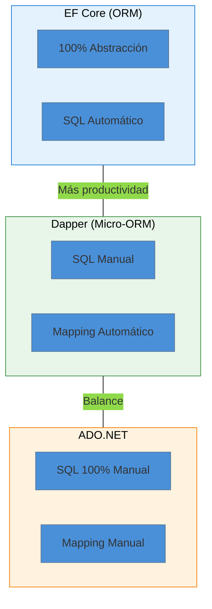

- [7. Repositorios con Dapper](#7-repositorios-con-dapper)
  - [7.1. Introducción a Dapper](#71-introducción-a-dapper)
    - [7.1.1. ¿Qué es Dapper?](#711-qué-es-dapper)
    - [7.1.2. La Pirámide de Acceso a Datos](#712-la-pirámide-de-acceso-a-datos)
    - [7.1.3. ¿Cuándo usar Dapper?](#713-cuándo-usar-dapper)
  - [7.2. Instalación](#72-instalación)
  - [7.3. Mapping Automático con Dapper](#73-mapping-automático-con-dapper)
    - [7.3.1. Cómo Funciona el Mapping](#731-cómo-funciona-el-mapping)
    - [7.3.2. Requisitos para el Mapping](#732-requisitos-para-el-mapping)
    - [7.3.3. Seguridad: Inyección SQL con Dapper](#733-seguridad-inyección-sql-con-dapper)
  - [7.4. Implementación con Clave Autonumérica](#74-implementación-con-clave-autonumérica)
    - [7.4.1. Entidad y Tabla](#741-entidad-y-tabla)
    - [7.4.2. El Repositorio](#742-el-repositorio)
  - [7.5. Implementación con Clave GUID](#75-implementación-con-clave-guid)
    - [7.5.1. Entidad y Tabla](#751-entidad-y-tabla)
    - [7.5.2. El Repositorio](#752-el-repositorio)
  - [7.6. Comparativa: ADO.NET vs Dapper](#76-comparativa-adonet-vs-dapper)
    - [7.6.1. Código comparativo](#761-código-comparativo)
    - [7.6.2. Tabla Comparativa](#762-tabla-comparativa)
  - [7.7. Ejemplo de Uso](#77-ejemplo-de-uso)
    - [7.7.1. Instalación de Paquetes](#771-instalación-de-paquetes)
    - [7.7.2. Crear la Tabla](#772-crear-la-tabla)
    - [7.7.3. Operaciones CRUD](#773-operaciones-crud)
  - [7.8. Resumen](#78-resumen)

# 7. Repositorios con Dapper

## 7.1. Introducción a Dapper

### 7.1.1. ¿Qué es Dapper?

**Dapper** es un **micro-ORM** creado por **Stack Overflow**. Es "más que un mapper de resultados" pero mucho más ligero que Entity Framework Core.

> 📝 **Nota del Profesor**: Dapper es el término medio perfecto. Tienes el control total del SQL (como ADO.NET) pero sin el mapeo manual de resultados (como EF Core).

### 7.1.2. La Pirámide de Acceso a Datos



### 7.1.3. ¿Cuándo usar Dapper?

- ✅ Necesitas control SQL (complejidad media-alta)
- ✅ El rendimiento es crítico
- ✅ No quieres todo el peso de EF Core
- ✅ Te gusta el SQL directo pero odias el boilerplate

> 💡 **Tip del Examinador**: Stack Overflow usa Dapper. Si lo usan para millones de peticiones al día, es suficientemente rápido para tu proyecto.

---

## 7.2. Instalación

```bash
dotnet add package Dapper
dotnet add package Microsoft.Data.Sqlite
```

---

## 7.3. Mapping Automático con Dapper

### 7.3.1. Cómo Funciona el Mapping

Dapper mapea automáticamente las columnas SQL a propiedades C# por **nombre coincidente**:

```csharp
// Tu clase C#
public class Persona(int Id, string Nombre, string Email, DateTime CreatedAt, DateTime UpdatedAt, bool IsDeleted, DateTime? DeletedAt)
{
    public int Id { get; set; }
    public string Nombre { get; set; } = string.Empty;
    public string Email { get; set; } = string.Empty;
}

// Dapper mapea:
// - Id (C#) ← Id (SQL)
// - Nombre (C#) ← Nombre (SQL)
```

### 7.3.2. Requisitos para el Mapping

| Requisito | Descripción |
|-----------|------------|
| **Nombre coincidente** | La propiedad C# debe llamarse igual que la columna SQL |
| **Constructor vacío** | Necesario para crear la instancia (usa `class`, no `record`) |
| **Propiedades públicas** | Las propiedades deben ser públicas |

> 📝 **Nota del Profesor**: Dapper requiere un **constructor sin parámetros** y propiedades públicas. Por eso se usa `class` en lugar de `record` para las entidades.

### ⚠️ 7.3.3. Seguridad: Inyección SQL con Dapper

Aunque Dapper protege contra inyección SQL, debes seguir buenas prácticas:

```csharp
// ✅ SEGURO: Parámetros (Dapper los sanitiza automáticamente)
const string sql = "SELECT * FROM Personas WHERE Email = @Email";
var persona = connection.QueryFirstOrDefault<Persona>(sql, new { Email = email });

// ✅ SEGURO: Múltiples parámetros
const string sql2 = "SELECT * FROM Personas WHERE Nombre = @Nombre AND Email = @Email";
var personas = connection.Query<Persona>(sql2, new { Nombre = nombre, Email = email });

// ❌ PELIGRO: NUNCA concatenas valores en SQL
// Dapper NO protege si haces esto manualmente:
// var sql = "SELECT * FROM Personas WHERE Email = '" + email + "'"; // ¡NO!
```

> ⚠️ **CRÍTICO**: Dapper usa **parámetros SQL** internamente. Siempre pasa los valores como objetos anónimos o parámetros tipados. Nunca concatenes strings para construir SQL.

---

## 7.4. Implementación con Clave Autonumérica

### 7.4.1. Entidad y Tabla

```csharp
public class Persona(int Id, string Nombre, string Email, DateTime CreatedAt, DateTime UpdatedAt, bool IsDeleted, DateTime? DeletedAt)
{
    public int Id { get; set; }
    public string Nombre { get; set; } = string.Empty;
    public string Email { get; set; } = string.Empty;
    public DateTime CreatedAt { get; set; }
    public DateTime UpdatedAt { get; set; }
    public bool IsDeleted { get; set; }
    public DateTime? DeletedAt { get; set; }
}
```

**Tabla en SQLite:**
```sql
CREATE TABLE IF NOT EXISTS Personas (
    Id INTEGER PRIMARY KEY AUTOINCREMENT,
    Nombre TEXT NOT NULL,
    Email TEXT,
    CreatedAt TEXT NOT NULL,
    UpdatedAt TEXT NOT NULL,
    IsDeleted INTEGER NOT NULL DEFAULT 0,
    DeletedAt TEXT
);
```

### 7.4.2. El Repositorio

```csharp
using Dapper;
using Microsoft.Data.Sqlite;

public class PersonaRepositoryDapper(SqliteConnection connection) : ICrudRepository<int, Persona>
{
    public IEnumerable<Persona> GetAll()
    {
        const string sql = "SELECT * FROM Personas WHERE IsDeleted = 0 ORDER BY Id";
        return connection.Query<Persona>(sql);
    }

    public Persona? GetById(int id)
    {
        const string sql = "SELECT * FROM Personas WHERE Id = @Id AND IsDeleted = 0";
        return connection.QueryFirstOrDefault<Persona>(sql, new { Id = id });
    }

    public Persona? Create(Persona persona)
    {
        const string sql = @"
            INSERT INTO Personas (Nombre, Email, CreatedAt, UpdatedAt, IsDeleted)
            VALUES (@Nombre, @Email, @CreatedAt, @UpdatedAt, @IsDeleted);
            SELECT last_insert_rowid();";

        persona = persona with 
        { 
            CreatedAt = DateTime.Now,
            UpdatedAt = DateTime.Now,
            IsDeleted = false
        };

        persona = persona with { Id = _connection.ExecuteScalar<int>(sql, persona) };
        return persona;
    }

    public Persona? Update(int id, Persona persona)
    {
        persona = persona with { Id = id, UpdatedAt = DateTime.Now };

        const string sql = @"
            UPDATE Personas 
            SET Nombre = @Nombre, Email = @Email, UpdatedAt = @UpdatedAt
            WHERE Id = @Id AND IsDeleted = 0";

        var filas = _connection.Execute(sql, persona);
        return filas > 0 ? GetById(id) : null;
    }

    public Persona? Delete(int id)
    {
        const string sql = @"
            UPDATE Personas 
            SET IsDeleted = 1, DeletedAt = @DeletedAt, UpdatedAt = @UpdatedAt
            WHERE Id = @Id AND IsDeleted = 0";

        var rows = _connection.Execute(sql, new 
        { 
            Id = id, 
            DeletedAt = DateTime.Now.ToString("o"),
            UpdatedAt = DateTime.Now.ToString("o")
        });
        
        return rows > 0 ? GetById(id) : null;
    }
}
```

---

## 7.5. Implementación con Clave GUID

### 7.5.1. Entidad y Tabla

```csharp
public class Persona(Guid Id, string Nombre, string Email, DateTime CreatedAt, DateTime UpdatedAt, bool IsDeleted, DateTime? DeletedAt)
{
    public Guid Id { get; set; } = Guid.NewGuid();
    public string Nombre { get; set; } = string.Empty;
    public string Email { get; set; } = string.Empty;
    public DateTime CreatedAt { get; set; }
    public DateTime UpdatedAt { get; set; }
    public bool IsDeleted { get; set; }
    public DateTime? DeletedAt { get; set; }
}
```

**Tabla en SQLite:**
```sql
CREATE TABLE IF NOT EXISTS Personas (
    Id TEXT PRIMARY KEY,
    Nombre TEXT NOT NULL,
    Email TEXT,
    CreatedAt TEXT NOT NULL,
    UpdatedAt TEXT NOT NULL,
    IsDeleted INTEGER NOT NULL DEFAULT 0,
    DeletedAt TEXT
);
```

### 7.5.2. El Repositorio

```csharp
public class PersonaRepositoryDapperGuid(SqliteConnection connection) : ICrudRepository<Guid, Persona>
{
    public IEnumerable<Persona> GetAll()
    {
        const string sql = "SELECT * FROM Personas WHERE IsDeleted = 0 ORDER BY CreatedAt DESC";
        return connection.Query<Persona>(sql);
    }

    public Persona? GetById(Guid id)
    {
        const string sql = "SELECT * FROM Personas WHERE Id = @Id AND IsDeleted = 0";
        return connection.QueryFirstOrDefault<Persona>(sql, new { Id = id.ToString() });
    }

    public Persona? Create(Persona persona)
    {
        persona = persona with 
        { 
            Id = Guid.NewGuid(),
            CreatedAt = DateTime.Now,
            UpdatedAt = DateTime.Now,
            IsDeleted = false
        };

        const string sql = @"
            INSERT INTO Personas (Id, Nombre, Email, CreatedAt, UpdatedAt, IsDeleted)
            VALUES (@Id, @Nombre, @Email, @CreatedAt, @UpdatedAt, @IsDeleted)";

        _connection.Execute(sql, persona);
        return persona;
    }

    public Persona? Update(Guid id, Persona persona)
    {
        persona = persona with { Id = id, UpdatedAt = DateTime.Now };

        const string sql = @"
            UPDATE Personas 
            SET Nombre = @Nombre, Email = @Email, UpdatedAt = @UpdatedAt
            WHERE Id = @Id AND IsDeleted = 0";

        var filas = _connection.Execute(sql, persona);
        return filas > 0 ? GetById(id) : null;
    }

    public Persona? Delete(Guid id)
    {
        const string sql = @"
            UPDATE Personas 
            SET IsDeleted = 1, DeletedAt = @DeletedAt, UpdatedAt = @UpdatedAt
            WHERE Id = @Id AND IsDeleted = 0";

        var rows = _connection.Execute(sql, new 
        { 
            Id = id.ToString(), 
            DeletedAt = DateTime.Now.ToString("o"),
            UpdatedAt = DateTime.Now.ToString("o")
        });
        
        return rows > 0 ? GetById(id) : null;
    }
}
```

---

## 7.6. Comparativa: ADO.NET vs Dapper

### 7.6.1. Código comparativo

**ADO.NET (18 líneas):**
```csharp
public Persona? GetById(int id)
{
    using var command = _connection.CreateCommand();
    command.CommandText = "SELECT * FROM Personas WHERE Id = @id";
    command.Parameters.AddWithValue("@id", id);
    
    using var reader = command.ExecuteReader();
    if (reader.Read())
    {
        return new Persona(...); // Mapeo manual
    }
    return null;
}
```

**Dapper (3 líneas):**
```csharp
public Persona? GetById(int id) => _connection.QueryFirstOrDefault<Persona>(
    "SELECT * FROM Personas WHERE Id = @Id", new { Id = id });
```

### 7.6.2. Tabla Comparativa

| Aspecto | ADO.NET | Dapper |
|---------|---------|--------|
| **Líneas de código** | ~50 | ~20 |
| **Mapping automático** | ❌ | ✅ |
| **Rendimiento** | Rápido | Muy rápido |
| **SQL** | 100% manual | 100% manual |

---

## 7.7. Ejemplo de Uso

### 7.7.1. Instalación de Paquetes

```bash
dotnet add package Dapper
dotnet add package Microsoft.Data.Sqlite
```

> ⚠️ **CRÍTICO - SQLite :memory: con Dapper**:
> - SQLite en memoria **no persiste** - se borra al cerrar la conexión.
> - **Usa Singleton** para la conexión, sino pierdes los datos:
> ```csharp
> // ❌ Scoped = datos perdidos
> services.AddScoped<SqliteConnection>(_ => new SqliteConnection(":memory:"));
> 
> // ✅ Singleton = datos persistentes
> services.AddSingleton<SqliteConnection>(_ => {
>     var conn = new SqliteConnection(":memory:");
>     conn.Open();
>     return conn;
> });
> ```

### 7.7.2. Crear la Tabla

```csharp
using Microsoft.Data.Sqlite;

var connectionString = "Data Source=personas.db";
using var connection = new SqliteConnection(connectionString);
connection.Open();

// Crear tabla
using var createCmd = connection.CreateCommand();
createCmd.CommandText = @"
    CREATE TABLE IF NOT EXISTS Personas (
        Id TEXT PRIMARY KEY,
        Nombre TEXT NOT NULL,
        Email TEXT,
        CreatedAt TEXT NOT NULL,
        UpdatedAt TEXT NOT NULL,
        IsDeleted INTEGER NOT NULL DEFAULT 0,
        DeletedAt TEXT
    )";
createCmd.ExecuteNonQuery();

Console.WriteLine("✓ Tabla creada correctamente");
```

### 7.7.3. Operaciones CRUD

```csharp
var repository = new PersonaRepositoryDapperGuid(connection);

// CREATE
var persona = repository.Create(new Persona(Guid.Empty, "Ana", "ana@correo.com", DateTime.Now, DateTime.Now, false, null));
Console.WriteLine($"✓ Creado: {persona.Id}");

// READ
var obtenido = repository.GetById(persona.Id);
Console.WriteLine($"✓ Obtenido: {obtenido?.Nombre}");

// UPDATE
repository.Update(persona.Id, new Persona(Guid.Empty, "Ana Nueva", "ana@correo.com", DateTime.Now, DateTime.Now, false, null));

// DELETE
repository.Delete(persona.Id);

// GET ALL
var todos = repository.GetAll();
```

---

## 7.8. Resumen

- **Dapper** ofrece mapping automático con SQL manual
- Reduce significativamente el código (~60% menos que ADO.NET)
- Ideal cuando necesitas SQL complejo sin boilerplate
- Perfecto para sistemas de alto rendimiento
- El mapping funciona por nombre de propiedad coincidente
- **Usa siempre parámetros** (`@Param`) para prevenir inyección SQL
