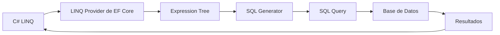

- [8. Repositorios con Entity Framework Core](#8-repositorios-con-entity-framework-core)
  - [8.1. Introducción](#81-introducción)
    - [8.1.1. ¿Qué es EF Core?](#811-qué-es-ef-core)
    - [8.1.2. ¿Cuándo usar EF Core?](#812-cuándo-usar-ef-core)
  - [8.2. Instalación de Paquetes](#82-instalación-de-paquetes)
    - [8.2.1. Paquetes Necesarios](#821-paquetes-necesarios)
  - [8.3. Entidad con Data Annotations](#83-entidad-con-data-annotations)
    - [8.3.1. Anotaciones Principales](#831-anotaciones-principales)
    - [8.3.2. Tabla Comparativa](#832-tabla-comparativa)
  - [8.4. DbContext](#84-dbcontext)
    - [8.4.1. ¿Qué es DbContext?](#841-qué-es-dbcontext)
    - [8.4.2. Proveedores Disponibles](#842-proveedores-disponibles)
    - [8.4.3. Creación de la Base de Datos](#843-creación-de-la-base-de-datos)
  - [8.5. Implementación del Repositorio](#85-implementación-del-repositorio)
    - [8.5.1. Con Clave Autonumérica](#851-con-clave-autonumérica)
    - [8.5.2. Con Clave GUID](#852-con-clave-guid)
  - [8.6. Uso](#86-uso)
    - [8.6.1. Ejemplo Completo](#861-ejemplo-completo)
    - [8.6.2. SQL Generado](#862-sql-generado)
  - [8.6. LINQ y Entity Framework Core](#86-linq-y-entity-framework-core)
    - [8.6.1. ¿Por qué LINQ?](#861-por-qué-linq)
    - [8.6.2. Cómo funciona la traducción](#862-cómo-funciona-la-traducción)
    - [8.6.3. Ejemplos de traducción](#863-ejemplos-de-traducción)
    - [8.6.4. Ejemplos prácticos](#864-ejemplos-prácticos)
    - [8.6.5. Operaciones que se traducen a SQL vs en memoria](#865-operaciones-que-se-traducen-a-sql-vs-en-memoria)
    - [8.6.6. Ver el SQL generado](#866-ver-el-sql-generado)
  - [8.7. Comparativa](#87-comparativa)
    - [8.7.1. Tabla Comparativa](#871-tabla-comparativa)
  - [8.8. Resumen](#88-resumen)

# 8. Repositorios con Entity Framework Core

## 8.1. Introducción

### 8.1.1. ¿Qué es EF Core?

**Entity Framework Core** es el ORM completo de Microsoft para .NET moderno. Abstrae completamente el SQL.

> 📝 **Nota del Profesor**: EF Core es como un asistente personal que traduce tus intenciones en SQL. Tú le dices "dame todos los estudiantes con nota mayor a 5" y él genera la consulta SQL correspondiente.

**Diferencias fundamentales con ADO.NET/Dapper:**

| Aspecto | ADO.NET/Dapper | EF Core |
|---------|----------------|---------|
| **SQL** | Lo escribes tú | Lo genera EF Core |
| **Mapping** | Manual o automático | Automático |
| **Change Tracking** | No existe | ✅ Sí (detecta cambios) |

### 8.1.2. ¿Cuándo usar EF Core?

- ✅ Cuando prefieres no escribir SQL
- ✅ Cuando necesitas migraciones automáticas
- ✅ Cuando el modelo de datos es complejo
- ✅ Para desarrollo rápido (RAD)
- ✅ Cuando quieres abstracción total de la BD

---

## 8.2. Instalación de Paquetes

### 8.2.1. Paquetes Necesarios

```bash
# Paquete base de EF Core
dotnet add package Microsoft.EntityFrameworkCore

# Proveedor SQLite
dotnet add package Microsoft.EntityFrameworkCore.Sqlite

# Proveedor InMemory (para testing)
dotnet add package Microsoft.EntityFrameworkCore.InMemory

# Herramientas de diseño (para migraciones)
dotnet add package Microsoft.EntityFrameworkCore.Design
```

---

## 8.3. Entidad con Data Annotations

Las **anotaciones** (o atributos) configuran el mapeo entre la clase C# y la tabla SQL:

```csharp
using System.ComponentModel.DataAnnotations;
using System.ComponentModel.DataAnnotations.Schema;

[Table("Personas")]  // Nombre de la tabla en la BD
public class Persona
{
    [Key]  // Es la clave primaria
    [DatabaseGenerated(DatabaseGeneratedOption.Identity)]  // Autonumérico
    public int Id { get; set; }

    [Required]  // NOT NULL
    [MaxLength(100)]  // VARCHAR(100)
    public string Nombre { get; set; } = string.Empty;

    [MaxLength(200)]
    public string Email { get; set; } = string.Empty;

    [Column("CreatedAt")]  // Nombre de la columna en la BD
    public DateTime CreatedAt { get; set; }

    [Column("UpdatedAt")]
    public DateTime UpdatedAt { get; set; }

    [Column("IsDeleted")]
    public bool IsDeleted { get; set; }

    [Column("DeletedAt")]
    public DateTime? DeletedAt { get; set; }
}
```

### 8.3.1. Anotaciones Principales

| Anotación | Propósito | Equivalente SQL |
|-----------|-----------|-----------------|
| `[Key]` | Define la clave primaria | `PRIMARY KEY` |
| `[Required]` | Campo obligatorio | `NOT NULL` |
| `[MaxLength(n)]` | Longitud máxima | `VARCHAR(n)` |
| `[DatabaseGenerated(Identity)]` | Autonumérico | `AUTOINCREMENT` |
| `[DatabaseGenerated(None)]` | No generado por BD | - |
| `[DatabaseGenerated(Computed)]` | Calculado por la BD | - |
| `[Table("nombre")]` | Nombre de la tabla | `CREATE TABLE "nombre"` |
| `[Column("nombre")]` | Nombre de la columna | `"nombre"` |
| `[NotMapped]` | No se mapea a la BD | - |


Para los campos `unique` o index se usa la anotación `[Index]` (disponible en EF Core 5+):

```csharp
[Index(nameof(Email), IsUnique = true)]
public class Persona
{
    // ...
}
```

### 8.3.2. Tabla Comparativa

| Anotación C# | SQLite | SQL Server | PostgreSQL |
|-------------|--------|------------|------------|
| `[Key]` | `INTEGER PRIMARY KEY` | `INT PRIMARY KEY` | `SERIAL PRIMARY KEY` |
| `[Required]` | `NOT NULL` | `NOT NULL` | `NOT NULL` |
| `[MaxLength(100)]` | `VARCHAR(100)` | `VARCHAR(100)` | `VARCHAR(100)` |
| `[DatabaseGenerated(Identity)]` | `AUTOINCREMENT` | `IDENTITY(1,1)` | `SERIAL` |
| `[DatabaseGenerated(None)]` | - | - | - |
| `[Table("Personas")]` | `CREATE TABLE "Personas"` | `CREATE TABLE [Personas]` | `CREATE TABLE "Personas"` |
| `[Column("CreatedAt")]` | `"CreatedAt"` | `[CreatedAt]` | `"CreatedAt"` |
| `[Index(nameof(Email), IsUnique = true)]` | `CREATE UNIQUE INDEX IX_Personas_Email ON Personas(Email)` | `CREATE UNIQUE INDEX IX_Personas_Email ON Personas(Email)` | `CREATE UNIQUE INDEX IX_Personas_Email ON Personas(Email)` |

---

## 8.4. DbContext

### 8.4.1. ¿Qué es DbContext?

El **DbContext** es el punto de entrada a EF Core. Representa una sesión con la base de datos.

> 📝 **Nota del Profesor**: El DbContext es como un **carrito de compras**. Añades productos (entidades), modificas cantidades, y cuando llamas a `SaveChanges()`, se aplica todo a la base de datos de golpe (transaccionalmente).

```csharp
using Microsoft.EntityFrameworkCore;

public class AppDbContext : DbContext
{
    public DbSet<Persona> Personas { get; set; } = null!;

    public AppDbContext(DbContextOptions<AppDbContext> options) : base(options) { }

    protected override void OnConfiguring(DbContextOptionsBuilder optionsBuilder)
    {
        if (!optionsBuilder.IsConfigured)
        {
            optionsBuilder.UseSqlite("Data Source=personas.db");
        }
    }
}
```

### 8.4.2. Proveedores Disponibles

| Proveedor | Método | Uso |
|-----------|--------|-----|
| SQLite | `UseSqlite(connectionString)` | Desarrollo, embebido |
| SQL Server | `UseSqlServer(connectionString)` | Producción Microsoft |
| PostgreSQL | `UseNpgsql(connectionString)` | Código abierto |
| MySQL | `UseMySql(connectionString)` | MySQL/MariaDB |
| InMemory | `UseInMemoryDatabase(name)` | Testing |

```csharp
// SQLite
options.UseSqlite("Data Source=personas.db");

// SQL Server
options.UseSqlServer("Server=localhost;Database=miBD;Trusted_Connection=True");

// PostgreSQL
options.UseNpgsql("Host=localhost;Database=miBD;Username=user;Password=pass");

// InMemory (testing) - ✅ Scoped funciona, EF gestiona internamente
options.UseInMemoryDatabase("TestDb");
```

> ⚠️ **Importante - InMemory**: 
> - EF Core gestiona la conexión internamente, NO depende de una conexión SQLite real.
> - **Scoped funciona perfectamente** - no necesitas Singleton.
> - **NO es SQLite real** - es una simulación sin restricciones SQL.

### 8.4.3. Creación de la Base de Datos

EF Core puede crear la base de datos automáticamente:

```csharp
using var context = new AppDbContext();

// Opción 1: Crea si no existe (no actualiza si ya existe)
context.Database.EnsureCreated();

// Opción 2: Elimina y crea desde cero (para testing)
context.Database.EnsureDeleted();
context.Database.EnsureCreated();
```

> 📝 **Nota del Profesor**: `EnsureCreated()` es útil para desarrollo y testing, pero para producción usa **migraciones** (`dotnet ef migrations`).

---

## 8.5. Implementación del Repositorio

### 8.5.1. Con Clave Autonumérica

```csharp
public class PersonaRepositoryEF(AppDbContext context) : ICrudRepository<int, Persona>
{
    public IEnumerable<Persona> GetAll()
    {
        return context.Personas.ToList();
    }

    public Persona? GetById(int id)
    {
        return context.Personas.Find(id);
    }

    public Persona? Create(Persona persona)
    {
        persona.CreatedAt = DateTime.Now;
        persona.UpdatedAt = DateTime.Now;
        persona.IsDeleted = false;

        context.Personas.Add(persona);
        context.SaveChanges();
        
        return persona;
    }

    public Persona? Update(int id, Persona persona)
    {
        var existente = context.Personas.Find(id);
        
        if (existente == null || existente.IsDeleted)
            return null;

        existente.Nombre = persona.Nombre;
        existente.Email = persona.Email;
        existente.UpdatedAt = DateTime.Now;

        context.SaveChanges();
        return existente;
    }

    public Persona? Delete(int id)
    {
        var persona = context.Personas.Find(id);
        
        if (persona == null || persona.IsDeleted)
            return null;

        persona.IsDeleted = true;
        persona.DeletedAt = DateTime.Now;
        persona.UpdatedAt = DateTime.Now;

        context.SaveChanges();
        return persona;
    }
}
```

### 8.5.2. Con Clave GUID

```csharp
public class Persona
{
    [Key]
    [DatabaseGenerated(DatabaseGeneratedOption.None)]  // ⚠️ La app genera el ID
    public Guid Id { get; set; } = Guid.NewGuid();
    
    [Required]
    [MaxLength(100)]
    public string Nombre { get; set; } = string.Empty;

    [MaxLength(200)]
    public string Email { get; set; } = string.Empty;

    [Column("CreatedAt")]
    public DateTime CreatedAt { get; set; }

    [Column("UpdatedAt")]
    public DateTime UpdatedAt { get; set; }

    [Column("IsDeleted")]
    public bool IsDeleted { get; set; }

    [Column("DeletedAt")]
    public DateTime? DeletedAt { get; set; }
}
```

> 📝 **Nota del Profesor**: Con GUID, usamos `[DatabaseGenerated(None)]` para indicar que la base de datos **NO** genera el valor. El valor se genera en C# con `Guid.NewGuid()`.

---

## 8.6. Uso

### 8.6.1. Ejemplo Completo

```csharp
var options = new DbContextOptionsBuilder<AppDbContext>()
    .UseSqlite("Data Source=personas.db")
    .Options;

using var context = new AppDbContext(options);

context.Database.EnsureCreated();

var repository = new PersonaRepositoryEF(context);

// CREATE
var persona = repository.Create(new Persona { Nombre = "Ana", Email = "ana@correo.com" });
Console.WriteLine($"✓ Creado: {persona.Id} - {persona.Nombre}");

// READ
var obtener = repository.GetById(persona.Id);
Console.WriteLine($"✓ Obtenido: {obtener?.Nombre}");

// UPDATE
repository.Update(persona.Id, new Persona { Nombre = "Ana Actualizada", Email = "ana@correo.com" });

// DELETE (lógico)
repository.Delete(persona.Id);

// READ ALL
var todos = repository.GetAll();
```

### 8.6.2. SQL Generado

EF Core traduce automáticamente las operaciones LINQ a SQL:

```sql
-- GetAll()
SELECT Id, Nombre, Email, CreatedAt, UpdatedAt, IsDeleted, DeletedAt 
FROM Personas

-- GetById(1)
SELECT Id, Nombre, Email, CreatedAt, UpdatedAt, IsDeleted, DeletedAt 
FROM Personas
WHERE Id = 1

-- Create()
INSERT INTO Personas (Nombre, Email, CreatedAt, UpdatedAt, IsDeleted)
VALUES ('Ana', 'ana@correo.com', '2024-01-01', '2024-01-01', 0);
SELECT last_insert_rowid();

-- Update()
UPDATE Personas SET Nombre = 'Ana Actualizada', UpdatedAt = '2024-01-01' 
WHERE Id = 1;

-- Delete() [lógico]
UPDATE Personas SET IsDeleted = 1, DeletedAt = '2024-01-01', UpdatedAt = '2024-01-01' 
WHERE Id = 1;
```

---

## 8.6. LINQ y Entity Framework Core

### 8.6.1. ¿Por qué LINQ?

**LINQ (Language Integrated Query)** es una característica de C# que permite escribir consultas directamente en código C# usando una sintaxis declarativa. EF Core está **totalmente integrado** con LINQ, lo que significa que cada operación LINQ que escribes se traduce internamente a SQL.

```csharp
// C# con LINQ - tú escribes esto:
var personas = context.Personas
    .Where(p => p.Edad > 18)
    .OrderBy(p => p.Nombre)
    .Select(p => new { p.Nombre, p.Email })
    .ToList();

// EF Core traduce internamente a:
SELECT Nombre, Email FROM Personas WHERE Edad > 18 ORDER BY Nombre
```

### 8.6.2. Cómo funciona la traducción

**Arquitectura de traducción:**



**Proceso interno:**
1. **Escribes** consultas LINQ en C#
2. **EF Core** crea un **Expression Tree** (árbol de expresiones)
3. El **SQL Generator** traduce el árbol a SQL
4. Se ejecuta en la **BD**
5. Los resultados se **mapean** a objetos C#

### 8.6.3. Ejemplos de traducción

| LINQ en C# | SQL Generado |
|------------|-------------|
| `.Where(p => p.Edad > 18)` | `WHERE Edad > 18` |
| `.OrderBy(p => p.Nombre)` | `ORDER BY Nombre` |
| `.Select(p => p.Nombre)` | `SELECT Nombre` |
| `.Take(10)` | `TOP 10` (SQL Server) / `LIMIT 10` (SQLite) |
| `.Skip(5).Take(10)` | `OFFSET 5 ROWS FETCH NEXT 10 ROWS ONLY` |
| `.Count()` | `SELECT COUNT(*)` |
| `.Any()` | `SELECT CASE WHEN EXISTS(...) THEN 1 ELSE 0 END` |
| `.FirstOrDefault()` | `SELECT TOP 1 ...` |

### 8.6.4. Ejemplos prácticos

**Filtrado con múltiples condiciones:**

```csharp
// C#
var adultos = context.Personas
    .Where(p => p.Edad >= 18 && p.Activo == true)
    .ToList();

// SQL equivalente
SELECT * FROM Personas WHERE Edad >= 18 AND Activo = 1
```

**Proyecciones (Select):**

```csharp
// C# - seleccionar solo campos necesarios
var nombres = context.Personas
    .Where(p => p.Edad > 18)
    .Select(p => p.Nombre)  // Proyección
    .ToList();

// SQL - solo selecciona la columna necesaria
SELECT Nombre FROM Personas WHERE Edad > 18
```

**Ordenamiento:**

```csharp
// C#
var ordenados = context.Personas
    .OrderByDescending(p => p.Edad)
    .ThenBy(p => p.Nombre)
    .ToList();

// SQL
SELECT * FROM Personas ORDER BY Edad DESC, Nombre ASC
```

**Paginación:**

```csharp
// C#
var pagina2 = context.Personas
    .OrderBy(p => p.Nombre)
    .Skip(10)  // Saltar 10 registros
    .Take(10)  // Tomar 10 registros
    .ToList();

// SQL (SQL Server)
SELECT * FROM Personas ORDER BY Nombre 
OFFSET 10 ROWS FETCH NEXT 10 ROWS ONLY
```

**Agregados:**

```csharp
// C#
var total = context.Personas.Count();
var promedio = context.Personas.Average(p => p.Edad);
var suma = context.Personas.Sum(p => p.Edad);

// SQL
SELECT COUNT(*) FROM Personas
SELECT AVG(Edad) FROM Personas  
SELECT SUM(Edad) FROM Personas
```

### 8.6.5. Operaciones que se traducen a SQL vs en memoria

**Se traducen a SQL:**
- `Where`, `Select`, `OrderBy`, `GroupBy`
- `Take`, `Skip`, `First`, `Single`
- `Count`, `Sum`, `Average`, `Min`, `Max`
- `Any`, `All`, `Contains`

**Se ejecutan en memoria (después de traer datos):**
- `.ToList()` - trae todo a memoria
- `.ToListAsync()` - versión asíncrona
- Funciones personalizadas de C#

```csharp
// ⚠️ CUIDADO: Esto trae TODOS los registros y filtra en memoria!
var adultos = context.Personas.ToList().Where(p => p.Edad > 18);

// ✅ CORRECTO: El Where se traduce a SQL
var adultos = context.Personas.Where(p => p.Edad > 18).ToList();
```

### 8.6.6. Ver el SQL generado

**Para depurar y aprender:**

```csharp
// Opción 1: logging básico
var options = new DbContextOptionsBuilder<AppDbContext>()
    .LogTo(Console.WriteLine)
    .Options;

// Opción 2: ver SQL generado
var query = context.Personas.Where(p => p.Edad > 18);
Console.WriteLine(query.ToQueryString());

// Opción 3: usando EF Core Profiler
// Instalar Microsoft.EntityFrameworkCore.Proxies
```

---

## 8.7. Comparativa

### 8.7.1. Tabla Comparativa

| Aspecto | ADO.NET | Dapper | EF Core |
|---------|---------|--------|---------|
| **SQL** | 100% manual | 100% manual | Automático |
| **Mapping** | Manual | Automático | Automático |
| **Líneas de código** | ~50 | ~20 | ~15 |
| **Rendimiento** | Rápido | Muy rápido | Rápido |
| **Flexibilidad** | Máxima | Alta | Media |
| **Curva aprendizaje** | Baja | Baja | Media |
| **Migraciones** | ❌ | ❌ | ✅ |
| **Change Tracking** | ❌ | ❌ | ✅ |

> 💡 **Tip del Examinador**: En el examen, si te preguntan "necesito máxima flexibilidad y control SQL", responde **Dapper**. Si te preguntan "quiero desarrollar rápido sin escribir SQL", responde **EF Core**.

---

## 8.8. Resumen

- **EF Core** abstrae completamente el SQL
- Las entidades se configuran con **Data Annotations**
- **DbContext** gestiona la conexión y el tracking de cambios
- El repositorio usa **LINQ** para consultas
- **Change Tracking** detecta cambios automáticamente
- Con GUID, usar `[DatabaseGenerated(None)]`
- Ideal para desarrollo rápido, menos ideal para SQL muy complejo
- Para producción, usar **migraciones**
