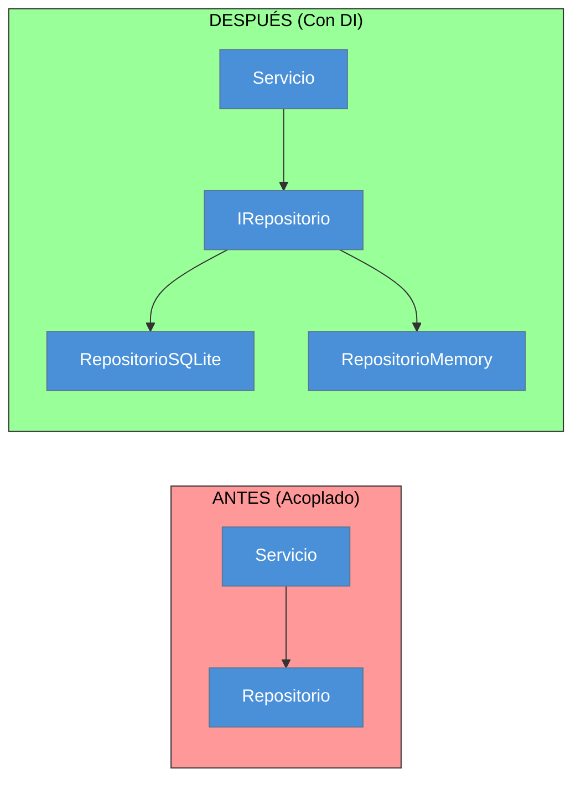
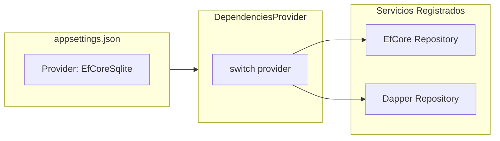

- [9. Inyección de Dependencias](#9-inyección-de-dependencias)
  - [9.1. El Problema del Acoplamiento](#91-el-problema-del-acoplamiento)
    - [9.1.1. Acoplamiento Fuerte](#911-acoplamiento-fuerte)
    - [9.1.2. ¿Por qué es Problemático?](#912-por-qué-es-problemático)
  - [9.2. Principio de Inversión de Dependencias](#92-principio-de-inversión-de-dependencias)
    - [9.2.1. ¿Qué es DIP?](#921-qué-es-dip)
    - [9.2.2. Diagrama Visual](#922-diagrama-visual)
  - [9.3. Tipos de Inyección](#93-tipos-de-inyección)
    - [9.3.1. Inyección por Constructor](#931-inyección-por-constructor)
    - [9.3.2. Inyección por Propiedad](#932-inyección-por-propiedad)
    - [9.3.3. Inyección por Método](#933-inyección-por-método)
  - [9.4. Inyección en .NET](#94-inyección-en-net)
    - [9.4.1. Instalación de Paquetes](#941-instalación-de-paquetes)
    - [9.4.2. Contenedor de DI](#942-contenedor-de-di)
  - [9.5. Configuración con appsettings.json](#95-configuración-con-appsettingsjson)
    - [9.5.1. Estructura del Archivo](#951-estructura-del-archivo)
    - [9.5.2. Lectura de Configuración](#952-lectura-de-configuración)
  - [9.6. Ejemplo Completo](#96-ejemplo-completo)
    - [9.6.1. Interfaces](#961-interfaces)
    - [9.6.2. Implementaciones](#962-implementaciones)
    - [9.6.3. Registro de Servicios](#963-registro-de-servicios)
  - [9.7. DependenciesProvider (Patrón Centralizado)](#97-dependenciesprovider-patrón-centralizado)
    - [9.7.1. ¿Por qué centralizar?](#971-por-qué-centralizar)
    - [9.7.2. Implementación](#972-implementación)
    - [9.7.3. Uso en Program](#973-uso-en-program)
    - [9.7.4. Ejemplo con Múltiples Proveedores](#974-ejemplo-con-múltiples-proveedores)
  - [9.8. Ciclos de Vida (Lifetime)](#98-ciclos-de-vida-lifetime)
    - [9.8.1. Transient](#981-transient)
    - [9.8.2. Scoped](#982-scoped)
    - [9.8.3. Singleton](#983-singleton)
    - [9.8.4. Comparativa](#984-comparativa)
  - [9.9. Resumen](#99-resumen)

# 9. Inyección de Dependencias

## 9.1. El Problema del Acoplamiento

### 9.1.1. Acoplamiento Fuerte

El **acoplamiento** es cuando una clase depende directamente de otra:

```csharp
// ❌ PROBLEMA: Acoplamiento fuerte
public class PersonaService
{
    // La dependencia está "hardcodeada"
    private readonly PersonaRepository _repository = new();  
    
    public void Guardar(Persona persona)
    {
        _repository.Create(persona);  // No se puede cambiar el repositorio
    }
}
```

### 9.1.2. ¿Por qué es Problemático?

| Problema | Descripción |
|----------|-------------|
| Difícil de testear | Necesitas usar la BD real |
| No extensible | No puedes cambiar la implementación |
| Violación SRP | La clase crea sus propias dependencias |
| Fragilidad | Cambios en el repositorio rompen el servicio |

> 📝 **Nota del Profesor**: Es como tener un amigo imaginario que siempre te ayuda. ¿Qué pasa si necesitas ayuda de otra persona? No puedes cambiar. Las dependencias "hardcodeadas" son igual de problemáticas.

---

## 9.2. Principio de Inversión de Dependencias

### 9.2.1. ¿Qué es DIP?

> Las clases de **alto nivel** no deben depender de clases de **bajo nivel**. Ambas deben depender de **abstracciones**.

### 9.2.2. Diagrama Visual



**Implementación:**

```csharp
// ✅ Interfaz (abstracción)
public interface IPersonaRepository
{
    Persona? Create(Persona persona);
    IEnumerable<Persona> GetAll();
}

// ✅ Implementación concreta
public class PersonaRepository : IPersonaRepository { ... }

// ✅ Servicio depende de abstracción (constructor primario)
public class PersonaService(IPersonaRepository repository)
{
    public void Guardar(Persona persona) => repository.Create(persona);
}
    }
}
```

---

## 9.3. Tipos de Inyección

### 9.3.1. Inyección por Constructor

La más común y recomendada:

```csharp
public class PersonaService(IPersonaRepository repository)
{
}
```

### 9.3.2. Inyección por Propiedad

Útil para dependencias opcionales:

```csharp
public class PersonaService
{
    public IPersonaRepository? Repository { get; set; }
}
```

### 9.3.3. Inyección por Método

Para casos específicos:

```csharp
public class PersonaService
{
    public void Guardar(Persona persona, IPersonaRepository repository)
    {
        repository.Create(persona);
    }
}
```

> 📝 **Nota del Profesor**: La inyección por **constructor** es la más común porque:
> - Es explícita (ves las dependencias)
> - Es inmutable (no cambian)
> - Es fácil de testear (mockeas las dependencias)

---

## 9.4. Inyección en .NET

### 9.4.1. Instalación de Paquetes

```bash
# .NET 6+ ya incluye DI incorporado
# No necesitas instalar nada extra para aplicaciones de consola

# Paquetes necesarios para el patrón DependenciesProvider:
dotnet add package Microsoft.Extensions.DependencyInjection
dotnet add package Microsoft.Extensions.Configuration
dotnet add package Microsoft.Extensions.Configuration.Json
dotnet add package Microsoft.EntityFrameworkCore.Sqlite
dotnet add package Microsoft.EntityFrameworkCore.InMemory
dotnet add package Dapper
dotnet add package Microsoft.Data.Sqlite
```

> 📝 **Nota**: Para aplicaciones web (ASP.NET Core) ya viene incluido por defecto.

### 9.4.2. Contenedor de DI

.NET tiene un **contenedor de inyección de dependencias** incorporado:

```csharp
var builder = Host.CreateApplicationBuilder(args);

// Registrar servicios
builder.Services.AddSingleton<IPersonaRepository, PersonaRepository>();
builder.Services.AddTransient<IPersonaService, PersonaService>();

// Ejecutar
var host = builder.Build();
var service = host.Services.GetRequiredService<IPersonaService>();
```

---

## 9.5. Configuración con appsettings.json

### 9.5.1. Estructura del Archivo

```json
{
  "Database": {
    "Provider": "Sqlite",
    "ConnectionString": "Data Source=personas.db"
  },
  "Logging": {
    "LogLevel": {
      "Default": "Information"
    }
  }
}
```

### 9.5.2. Lectura de Configuración

```csharp
var builder = Host.CreateApplicationBuilder(args);

// Leer configuración
var config = builder.Configuration;
var provider = config["Database:Provider"];
var connectionString = config["Database:ConnectionString"];

// Registrar DbContext según configuración
builder.Services.AddDbContext<AppDbContext>(options =>
{
    switch (provider)
    {
        case "Sqlite": 
            options.UseSqlite(connectionString); 
            break;
        case "InMemory": 
            options.UseInMemoryDatabase("TestDb"); 
            break;
        case "SqlServer":
            options.UseSqlServer(connectionString);
            break;
    }
});
```

---

## 9.6. Ejemplo Completo

### 9.6.1. Interfaces

```csharp
// interfaces/IPersonaRepository.cs
public interface IPersonaRepository
{
    IEnumerable<Persona> GetAll();
    Persona? GetById(int id);
    Persona? Create(Persona persona);
    Persona? Update(int id, Persona persona);
    Persona? Delete(int id);
}

// interfaces/IPersonaService.cs
public interface IPersonaService
{
    IEnumerable<Persona> GetAll();
    Persona? GetById(int id);
    Persona? Create(Persona persona);
    Persona? Update(int id, Persona persona);
    Persona? Delete(int id);
}
```

### 9.6.2. Implementaciones

```csharp
// repositories/PersonaRepository.cs
public class PersonaRepository(AppDbContext context) : IPersonaRepository
{    
    public IEnumerable<Persona> GetAll() => context.Personas.ToList();
    
    public Persona? GetById(int id) => context.Personas.Find(id);
    
    public Persona? Create(Persona persona) { ... }
    
    public Persona? Update(int id, Persona persona) { ... }
    
    public Persona? Delete(int id) { ... }
}

// services/PersonaService.cs
public class PersonaService(IPersonaRepository repository) : IPersonaService
{    
    public IEnumerable<Persona> GetAll() => repository.GetAll();
    
    public Persona? GetById(int id) => repository.GetById(id);
    
    public Persona? Create(Persona persona) => repository.Create(persona);
    
    public Persona? Update(int id, Persona persona) => repository.Update(id, persona);
    
    public Persona? Delete(int id) => repository.Delete(id);
}
```

### 9.6.3. Registro de Servicios

```csharp
// Program.cs
var builder = Host.CreateApplicationBuilder(args);

// Cargar configuración
var config = builder.Configuration;

// Registrar DbContext
builder.Services.AddDbContext<AppDbContext>(options =>
{
    var provider = config["Database:Provider"];
    var connectionString = config["Database:ConnectionString"];
    
    switch (provider)
    {
        case "Sqlite":
            options.UseSqlite(connectionString);
            break;
        case "InMemory":
            options.UseInMemoryDatabase("TestDb");
            break;
    }
});

// Registrar servicios
builder.Services.AddScoped<IPersonaRepository, PersonaRepository>();
builder.Services.AddScoped<IPersonaService, PersonaService>();

// Ejecutar
var host = builder.Build();
var service = host.Services.GetRequiredService<IPersonaService>();

// Usar el servicio
var personas = service.GetAll();
```

---

## 9.7. DependenciesProvider (Patrón Centralizado)

El patrón **DependenciesProvider** centraliza todo el registro de dependencias en una clase estática. Esto facilita el mantenimiento y permite cambiar la configuración de la aplicación sin modificar el código.

### 9.7.1. ¿Por qué centralizar?

| Beneficio | Descripción |
|-----------|-------------|
| **Mantenimiento** | Todos los registros de DI en un solo lugar |
| **Flexibilidad** | Cambiar implementaciones desde configuración |
| **Testabilidad** | Fácil crear contenedores de test |
| **Reusabilidad** | Reutilizar configuración en diferentes proyectos |

### 9.7.2. Implementación

```csharp
using Microsoft.EntityFrameworkCore;
using Microsoft.Data.Sqlite;
using Microsoft.Extensions.DependencyInjection;
using GestionPersonas.Config;
using GestionPersonas.Domain.Repositories;
using GestionPersonas.Domain.Validators;
using GestionPersonas.Services;
using GestionPersonas.Data.EfCore;
using GestionPersonas.Data.Dapper;

namespace GestionPersonas.Infrastructure;

public static class DependenciesProvider
{
    public static IServiceCollection AddServices(this IServiceCollection services)
    {
        // Configurar según el proveedor de base de datos (Factory Pattern)
        switch (AppConfig.DatabaseProvider)
        {
            case "EfCoreSqlite":
                // ✅ SQLite archivo -> persiste, Scoped funciona
                services.AddDbContext<AppDbContext>(options =>
                {
                    options.UseSqlite(AppConfig.ConnectionString);
                });
                services.AddScoped<IPersonaRepository, PersonaRepositoryEf>();
                break;
                
            case "EfCoreSqliteMemory":
                // ⚠️ SQLite memoria: EF gestiona internamente, Scoped funciona
                services.AddDbContext<AppDbContext>(options =>
                {
                    options.UseSqlite(":memory:");  // EF gestiona la conexión
                });
                services.AddScoped<IPersonaRepository, PersonaRepositoryEf>();
                break;
                
            case "EfCoreInMemory":
                // ✅ EF Core InMemory: gestiona internamente, Scoped funciona
                services.AddDbContext<AppDbContext>(options =>
                {
                    options.UseInMemoryDatabase(AppConfig.InMemoryName);
                });
                services.AddScoped<IPersonaRepository, PersonaRepositoryEf>();
                break;
                
            case "DapperSqlite":
                // ✅ Dapper + SQLite archivo: Scoped funciona
                services.AddScoped<SqliteConnection>(_ => 
                    new SqliteConnection(AppConfig.ConnectionString));
                services.AddScoped<IPersonaRepository, PersonaRepositoryDapper>();
                break;
                
            case "DapperSqliteMemory":
                // ⚠️ ⚠️ IMPORTANTE: SQLite memoria necesita Singleton o pierden datos
                services.AddSingleton<SqliteConnection>(_ => 
                {
                    var conn = new SqliteConnection(":memory:");
                    conn.Open();
                    return conn;
                });
                services.AddScoped<IPersonaRepository, PersonaRepositoryDapper>();
                break;
                
            default:
                Console.WriteLine($"⚠️ Proveedor desconocido: {AppConfig.DatabaseProvider}");
                services.AddDbContext<AppDbContext>(options =>
                {
                    options.UseSqlite(AppConfig.ConnectionString);
                });
                services.AddScoped<IPersonaRepository, PersonaRepositoryEf>();
                break;
        }
        
        // Registrar servicios de aplicación
        services.AddTransient<PersonaValidator>();
        services.AddTransient<IPersonaService, PersonaService>();
        
        return services;
    }
    
    public static IServiceProvider BuildServiceProvider()
    {
        var services = new ServiceCollection();
        services.AddServices();
        return services.BuildServiceProvider();
    }
}
```

> ⚠️ **CRÍTICO - Diferencias en el uso de memoria**:
> | Provider | Lifetime | ¿Por qué? |
> |----------|----------|------------|
> | `EfCoreSqlite` | Scoped ✅ | EF gestiona conexión SQLite |
> | `EfCoreSqliteMemory` | Scoped ✅ | EF gestiona internamente |
> | `EfCoreInMemory` | Scoped ✅ | EF gestiona internamente |
> | `DapperSqlite` | Scoped ✅ | Nueva conexión por request |
> | `DapperSqliteMemory` | **Singleton ⚠️** | SQLite :memory: muere si se cierra la conexión |

> 💡 **Recordatorio**: SQLite `:memory:` **no persiste**. Con Dapper SIEMPRE usa Singleton para `:memory:`, sino los datos desaparecen. EF Core lo gestiona internamente y funciona con Scoped.

### 9.7.3. Uso en Program

Con este patrón, el `Program.cs` queda muy limpio:

```csharp
using GestionPersonas.Config;
using GestionPersonas.Infrastructure;

Console.WriteLine($"Proveedor: {AppConfig.DatabaseProvider}");

// Una sola línea para crear el ServiceProvider
var serviceProvider = DependenciesProvider.BuildServiceProvider();

// Obtener servicios
var service = serviceProvider.GetRequiredService<IPersonaService>();
var repository = serviceProvider.GetRequiredService<IPersonaRepository>();

// Inicializar
repository.Initialize();
repository.SeedData();

// Usar el servicio
var personas = service.GetAll();
```

### 9.7.4. Ejemplo con Múltiples Proveedores

Este patrón es especialmente útil cuando tienes múltiples implementaciones del mismo repositorio:



> 💡 **Tip**: El patrón DependenciesProvider es ideal para aplicaciones que necesitan soportar múltiples bases de datos (SQLite, PostgreSQL, MySQL) o múltiples implementaciones (EF Core, Dapper) sin cambiar código.

---

## 9.8. Ciclos de Vida (Lifetime)

### 9.8.1. Transient

Cada solicitud crea una nueva instancia.

### 9.8.2. Scoped

Una instancia por request HTTP o ámbito.

### 9.8.3. Singleton

Una sola instancia para toda la aplicación.

### 9.8.4. Comparativa

---

## 9.9. Resumen

- La **inyección de dependencias** reduce el acoplamiento
- Las dependencias se definen mediante **interfaces**
- .NET tiene un **contenedor de DI incorporado**
- Los servicios se **registran** en Program.cs
- **appsettings.json** permite configuración externa
- **Transient**, **Scoped** y **Singleton** son los ciclos de vida disponibles
- Usa **Scoped** para DbContext y repositorios en aplicaciones web
