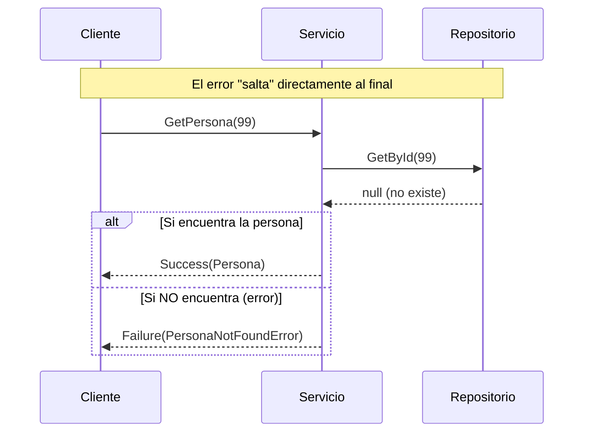

- [10. Railway Oriented Programming](#10-railway-oriented-programming)
  - [10.1. El Problema de las Excepciones](#101-el-problema-de-las-excepciones)
    - [10.1.1. ¿Por qué las excepciones no son ideales para control de flujo?](#1011-por-qué-las-excepciones-no-son-ideales-para-control-de-flujo)
    - [10.1.2. Ejemplo del Problema](#1012-ejemplo-del-problema)
  - [10.2. La Metáfora del Tren](#102-la-metáfora-del-tren)
    - [10.2.1. Diagrama Visual](#1021-diagrama-visual)
    - [10.2.2. Happy Path vs Error Path](#1022-happy-path-vs-error-path)
  - [10.3. El Tipo Result](#103-el-tipo-result)
    - [10.3.1. Definición](#1031-definición)
    - [10.3.2. Uso Básico](#1032-uso-básico)
  - [10.4. CSharpFunctionalExtensions](#104-csharpfunctionalextensions)
    - [10.4.1. Instalación](#1041-instalación)
    - [10.4.2. Jerarquía de Errores](#1042-jerarquía-de-errores)
  - [10.5. Operaciones con Result](#105-operaciones-con-result)
    - [10.5.1. Success y Failure: Crear Resultados](#1051-success-y-failure-crear-resultados)
    - [10.5.2. Bind: Encadenar Operacioness](#1052-bind-encadenar-operacioness)
    - [10.5.3. Map: Transformar el Valor](#1053-map-transformar-el-valor)
    - [10.5.4. MapError: Transformar el Error](#1054-maperror-transformar-el-error)
    - [10.5.5. Ensure: Validación Condicional](#1055-ensure-validación-condicional)
    - [10.5.6. Tap: Efectos Secundarios](#1056-tap-efectos-secundarios)
    - [10.5.7. Match: Consumir el Resultado](#1057-match-consumir-el-resultado)
    - [10.5.8. GetValueOrDefault: Obtener Valor o Default](#1058-getvalueordefault-obtener-valor-o-default)
  - [10.6. El Tipo Maybe](#106-el-tipo-maybe)
    - [10.6.1. ¿Qué es Maybe?](#1061-qué-es-maybe)
    - [10.6.2. Crear Maybe](#1062-crear-maybe)
    - [10.6.3. Maybe con Tipos Nullable](#1063-maybe-con-tipos-nullable)
    - [10.6.4. Operaciones con Maybe](#1064-operaciones-con-maybe)
    - [10.6.5. Maybe a Result: ToResult](#1065-maybe-a-result-toresult)
    - [10.6.6. ¿Cuándo usar Maybe vs Result?](#1066-cuándo-usar-maybe-vs-result)
  - [10.7. Ejemplo Completo](#107-ejemplo-completo)
    - [10.7.1. Errores de Dominio](#1071-errores-de-dominio)
    - [10.7.2. Servicio con Result (Patrón ROP)](#1072-servicio-con-result-patrón-rop)
    - [10.7.3. Uso](#1073-uso)
  - [10.8. Resumen](#108-resumen)

# 10. Railway Oriented Programming

## 10.1. El Problema de las Excepciones

### 10.1.1. ¿Por qué las excepciones no son ideales para control de flujo?

Las excepciones fueron diseñadas para **casos excepcionales**, pero frecuentemente se usan para control de flujo:

```csharp
// ❌ PROBLEMA: Excepciones para control de flujo
public Persona GetPersona(int id)
{
    try
    {
        return _repository.GetById(id);
    }
    catch (PersonaNotFoundException)
    {
        return null;  // Usar excepción para "no encontrado"
    }
}
```

**Problemas:**

| Problema | Descripción |
|----------|-------------|
| **Coste** | Las excepciones son costosas (crear stack trace) |
| **Flujo** | Rompen el flujo natural del código |
| **Encadenamiento** | Difíciles de encadenar |
| **Type-safety** | No son type-safe (el compilador no puede verificar el tipo) |
| **Documentación** | No sabes qué excepciones puede lanzar un método |

> 📝 **Nota del Profesor**: Lanzar una excepción es como usar un martillo para matar una mosca. Funciona, pero es excesivo. Las excepciones deberían ser para situaciones realmente excepcionales (base de datos no disponible, archivo corrupto), no para "el usuario no existe".

### 10.1.2. Ejemplo del Problema

```csharp
// ❌ Con excepciones: anidamiento y try-catch
public Result Proceso()
{
    try
    {
        var usuario = ObtenerUsuario(1);
        if (usuario == null) throw new NotFoundException();
        
        var pedido = ObtenerPedido(usuario.Id);
        if (pedido == null) throw new NotFoundException();
        
        var factura = GenerarFactura(pedido);
        if (factura == null) throw new GenerationException();
        
        return Result.Ok(factura);
    }
    catch (Exception ex)
    {
        return Result.Fail(ex.Message);
    }
}
```

---

## 10.2. La Metáfora del Tren

**Railway Oriented Programming (ROP)** modela el flujo como un tren con dos vías:

### 10.2.1. Diagrama Visual

```mermaid
flowchart LR
    subgraph Input["Entrada"]
        I[Input]
    end
    
    subgraph Track["Vía del Tren"]
        direction TB
        Op[Operación]
        Op -->|"Éxito"| ST[Success Track]
        Op -->|"Fallo"| FT[Failure Track]
    end
    
    subgraph Output["Salida"]
        direction TB
        ST -->|"Value"| SV[Result&#60;T,Error&#62;]
        FT -->|"Error"| SE[Result&#60;T,Error&#62;]
    end
    
    I --> Op
    
    style ST fill:#7cd97e,stroke:#333,color:#000
    style FT fill:#ff9999,stroke:#333,color:#000
    style SV fill:#ffdd57,stroke:#333,color:#000
    style SE fill:#ffdd57,stroke:#333,color:#000
```



**Concepto clave:**
- Si todo va bien, el tren sigue la vía del **éxito**
- Si algo falla, el tren pasa a la vía de **error**
- **No se necesita try-catch** en cada operación
- El error se propaga automáticamente

### 10.2.2. Happy Path vs Error Path

```mermaid
flowchart LR
    subgraph HappyPath["🌟 VÍA DEL ÉXITO (Happy Path)"]
        direction TB
        H1[Input] --> H2[Validar]
        H2 -->|"✓ OK"| H3[Buscar BD]
        H3 -->|"✓ Encontrado"| H4[Transformar]
        H4 -->|"✓ Éxito"| H5[Result&#60;T,Error&#62;]
    end
    
    subgraph ErrorPath["❌ VÍA DEL ERROR (Error Path)"]
        direction TB
        E1[Input] --> E2[Validar]
        E2 -->|"✗ Error"| E3[Result con Error]
        E3 -->|"✗ Error"| E4[Error se Propaga]
    end
    
    style HappyPath fill:#d4edda,stroke:#28a745,color:#000
    style ErrorPath fill:#f8d7da,stroke:#dc3545,color:#000
    style H1 fill:#fff,stroke:#28a745,color:#000
    style H2 fill:#fff,stroke:#28a745,color:#000
    style H3 fill:#fff,stroke:#28a745,color:#000
    style H4 fill:#fff,stroke:#28a745,color:#000
    style H5 fill:#28a745,stroke:#28a745,color:#000
    style E1 fill:#fff,stroke:#dc3545,color:#000
    style E2 fill:#fff,stroke:#dc3545,color:#000
    style E3 fill:#dc3545,stroke:#dc3545,color:#000
    style E4 fill:#dc3545,stroke:#dc3545,color:#000
```



**¿Qué pasa cuando falla?**



**Ejemplo: El tren nunca vuelve a la vía principal**

```csharp
// Si GetById falla, el error se propaga automáticamente
// ¡El código NUNCA continúa después del error!
Result<Persona, DomainError> GetPersona(int id)
{
    return _repository.GetById(id)           // ← Si esto falla...
        .ToResult(() => new NotFoundError()) // ← ...el error salta aquí
        .Ensure(p => !p.IsDeleted,           // ← ...y aquí
            new ValidationError("Eliminada"))
        .Map(p => p);                         // ← ...y aquí NUNCA llega
}
```

---

## 10.3. El Tipo Result

### 10.3.1. Definición

```csharp
// Representa éxito o fracaso
public struct Result<TValue, TError>
{
    public TValue? Value { get; }      // Valor si éxito
    public TError? Error { get; }     // Error si fracaso
    public bool IsSuccess { get; }     // ¿Fue bien?
    public bool IsFailure { get; }    // ¿Fue mal?
}
```

### 10.3.2. Uso Básico

```csharp
// Crear resultados
var ok = Result.Success<int, string>(42);
var fail = Result.Failure<int, string>("Error happened");

// Verificar
if (ok.IsSuccess)
{
    Console.WriteLine(ok.Value);  // 42
}

if (fail.IsFailure)
{
    Console.WriteLine(fail.Error);  // "Error happened"
}
```

---

## 10.4. CSharpFunctionalExtensions

### 10.4.1. Instalación

```bash
dotnet add package CSharpFunctionalExtensions
```

### 10.4.2. Jerarquía de Errores

```csharp
public abstract class DomainError 
{ 
    public string Message { get; }
}

public class PersonaNotFoundError : DomainError 
{ 
    public int Id { get; }
    public PersonaNotFoundError(int id) => Id = id;
    public override string ToString() => $"Persona con ID {Id} no encontrada";
}

public class ValidationError : DomainError 
{ 
    public string Message { get; }
    public ValidationError(string message) => Message = message;
    public override string ToString() => Message;
}

public class StorageError : DomainError 
{ 
    public Exception Exception { get; }
    public StorageError(Exception ex) => Exception = ex;
    public override string ToString() => Exception.Message;
}
```

---

## 10.5. Operaciones con Result

### 10.5.1. Success y Failure: Crear Resultados

```csharp
// Crear resultado de éxito
var ok = Result.Success<Persona, DomainError>(new Persona { Nombre = "Ana" });

// Crear resultado de fallo
var fail = Result.Failure<Persona, DomainError>(new PersonaNotFoundError(1));
var fail2 = Result.Failure<Persona, DomainError>(new ValidationError("Nombre requerido"));

// Convenience methods
var ok2 = Ok(new Persona { Nombre = "Juan" });
var fail3 = Fail<int, DomainError>(new ValidationError("Error"));
```

### 10.5.2. Bind: Encadenar Operacioness

**Sin Result (anidamiento de null checks):**

```csharp
public Persona? GetPersonaSegura(int id)
{
    var persona = _repository.GetById(id);
    if (persona == null) return null;
    if (persona.IsDeleted) return null;
    return persona;
}
```

**Con Result (encadenamiento fluido):**

```csharp
public Result<Persona, DomainError> GetPersonaSegura(int id)
{
    return _repository.GetById(id)
        .ToResult(() => new PersonaNotFoundError(id))           // Convertir null a error
        .Ensure(p => !p.IsDeleted, new ValidationError("Persona eliminada"));  // Validar
}
```

### 10.5.3. Map: Transformar el Valor

```csharp
// Transformar el valor en caso de éxito
Result<string, DomainError> nombre = resultado
    .Map(p => p.Nombre)  // Result<Persona, Error> → Result<string, Error>
    .GetValueOrDefault("Desconocido");

// Encadenar transformaciones
var email = resultado
    .Map(p => p.Email)
    .Map(e => e?.ToUpper())
    .GetValueOrDefault("SIN EMAIL");
```

### 10.5.4. MapError: Transformar el Error

```csharp
// Transformar el error
var resultadoProcesado = resultado
    .MapError(e => new UserFriendlyError(e.Message));

// Encadenar errores
var errorComplejo = resultado
    .MapError(e => new ValidationError($"Error: {e.Message}"));
```

### 10.5.5. Ensure: Validación Condicional

```csharp
// Validar condiciones
var validado = ObtenerPersona(1)
    .Ensure(p => p != null, new ValidationError("No existe"))
    .Ensure(p => p.IsActive, new ValidationError("Inactiva"))
    .Ensure(p => p.Edad >= 18, new ValidationError("Menor de edad"));
```

### 10.5.6. Tap: Efectos Secundarios

```csharp
public class PersonaService(IPersonaRepository repository, ILogger<PersonaService> logger) : IPersonaService
{
    public Result<Persona, DomainError> GetById(int id)
    {
        return repository.GetById(id)
            .Tap(p => logger.LogInformation($"Obtenida persona: {p.Nombre}"))
            .TapError(e => logger.LogError($"Error: {e.Message}"));
    }
}
```

### 10.5.7. Match: Consumir el Resultado

```csharp
// Forma 1: match con lambdas
resultado.Match(
    onSuccess: persona => Console.WriteLine($"Hola {persona.Nombre}"),
    onFailure: error => Console.WriteLine($"Error: {error}")
);

// Forma 2: if-else manual
if (resultado.IsSuccess)
{
    Console.WriteLine(resultado.Value.Nombre);
}
else
{
    Console.WriteLine(resultado.Error.Message);
}
```

### 10.5.8. GetValueOrDefault: Obtener Valor o Default

```csharp
// Con valor por defecto
var nombre = resultado.GetValueOrDefault("Desconocido");

// Con valor por defecto y error por defecto
var nombre2 = resultado.GetValueOrDefault(
    value: "Desconocido",
    error: new ValidationError("Error predeterminado")
);
```

---

## 10.6. El Tipo Maybe

### 10.6.1. ¿Qué es Maybe?

**Maybe** (también llamado Option) representa un valor que puede existir o no. Es la alternativa funcional a usar `null`:

```csharp
// En lugar de esto:
Persona? ObtenerPersona(int id);

//Hacemos esto:
Maybe<Persona> ObtenerPersona(int id);
```

### 10.6.2. Crear Maybe

```csharp
using CSharpFunctionalExtensions;

// Crear con valor
Maybe<Persona> conValor = new Persona { Nombre = "Ana" };
Maybe<Persona> conValor2 = Maybe.From(persona);  //Recomendado

// Crear sin valor (None)
Maybe<Persona> sinValor = Maybe<Persona>.None;
Maybe<Persona> sinValor2 = Maybe.From<Persona>(null);  //Recomendado
```

### 10.6.3. Maybe con Tipos Nullable

```csharp
// C# moderno: Maybe envuelve nullable automáticamente
Persona? persona = null;
Maybe<Persona> maybe = Maybe.From(persona);  // Convierte null a None
```

### 10.6.4. Operaciones con Maybe

```csharp
// HasValue / HasNoValue
if (maybe.HasValue)
    Console.WriteLine(maybe.Value);

if (maybe.HasNoValue)
    Console.WriteLine("No hay valor");

// Where: filtrar
Maybe<Persona> activo = maybe.Where(p => p.IsActive);

// Map: transformar
Maybe<string> nombre = maybe.Map(p => p.Nombre);

// Bind: encadenar
Maybe<Persona> persona = ObtenerPersona(1);
Maybe<string> email = persona.Bind(p => ObtenerEmail(p.Id));
```

### 10.6.5. Maybe a Result: ToResult

**La clave**: Maybe se convierte a Result para propagar errores:

```csharp
// Maybe → Result
Maybe<Persona> persona = repository.GetById(id);

// Si tiene valor → Success
// Si no tiene valor → Failure con el error dado
Result<Persona, DomainError> resultado = persona
    .ToResult(() => new PersonaNotFoundError(id));
```

**⚠️ PROBLEMA con CSharpFunctionalExtensions**: La librería tiene `ToResult` pero:
1. Solo acepta `string` como error (no tipos personalizados)
2. Al usar herencia de errores (`NotFound : DomainError`), C# no infiere el tipo base automáticamente

**SOLUCIÓN**: Creamos nuestra propia extensión:

```csharp
// Alias para abreviar el nombre largo del namespace
using CF = CSharpFunctionalExtensions;

namespace PersonaService.Extensions;

// ========== EXTENSIÓN PERSONALIZADA MAYBE.TORESULT ==========

// extension<T>(Maybe<T> maybe)
// - extension: nueva palabra clave de C# 13 para crear extension methods
// - <T>: tipo genérico que representa el valor dentro del Maybe
// - (Maybe<T> maybe): el tipo que estamos extendiendo
public static class MaybeExtensions
{
    // ========== PRIMER MÉTODO ==========
    // ToResult(error) - Versión con error directo
    
    // extension<T>: define el tipo genérico T para toda la extensión
    // where T : class: restricción - T debe ser un tipo clase (no struct)
    extension<T>(Maybe<T> maybe) where T : class
    {
        // public CF.Result<T, TError>: retorna un Result con tipo valor T y tipo error genérico
        // <TError>: el tipo de error es genérico (permite usar cualquier tipo de error)
        public CF.Result<T, TError> ToResult<TError>(TError error)
        {
            // Lógica:
            // 1. maybe.HasValue pregunta si el Maybe tiene un valor
            // 2. Si tiene valor → Success(maybe.Value) → convierte el valor en Result exitoso
            // 3. Si NO tiene valor → Failure(error) → convierte en Result fallido con el error dado
            
            return maybe.HasValue
                ? CF.Result.Success<T, TError>(maybe.Value)    // ✓ Hay valor → Éxito
                : CF.Result.Failure<T, TError>(error);         // ✗ No hay valor → Fallo
        }
        
        // ========== SEGUNDO MÉTODO ==========
        // ToResult(Func<TError> errorFactory) - Versión con factory (evaluación perezosa)
        
        // La diferencia: en lugar de recibir el error directamente, recibe una FUNCIÓN que lo crea
        // Esto es útil porque:
        // - El error solo se crea si es necesario (si maybe.HasValue es false)
        // - Evita crear objetos costosos (como strings interpolados) si no se necesitan
        
        public CF.Result<T, TError> ToResult<TError>(Func<TError> errorFactory)
        {
            // Lógica:
            // 1. Si maybe.HasValue → Success(valor) - el error NUNCA se crea
            // 2. Si !HasValue → errorFactory() - el error SOLO se crea cuando se necesita
            
            return maybe.HasValue
                ? CF.Result.Success<T, TError>(maybe.Value)
                : CF.Result.Failure<T, TError>(errorFactory()); // ← Solo se ejecuta si es null
        }
    }
}
```

**Resumen línea por línea:**

| Línea | Qué hace |
|-------|----------|
| `using CF = CSharpFunctionalExtensions;` | Alias para no escribir el nombre largo |
| `extension<T>(Maybe<T> maybe)` | Extiende el tipo Maybe<T> con nuevos métodos |
| `where T : class` | Restricción: T debe ser clase (no struct) |
| `ToResult<TError>(TError error)` | Método que acepta error directamente |
| `ToResult<TError>(Func<TError> errorFactory)` | Método que acepta factory lazy |
| `maybe.HasValue` | Pregunta si el Maybe tiene valor |
| `CF.Result.Success<T, TError>(value)` | Crea Result exitoso con el valor |
| `CF.Result.Failure<T, TError>(error)` | Crea Result fallido con el error |
| `errorFactory()` | Ejecuta la función solo si necesita el error |

**¿Por qué dos versiones?**

| Versión | Cuándo usarla | Ejemplo |
|---------|---------------|---------|
| `ToResult(error)` | Error ya creado | `ToResult(DomainErrors.NotFound(1))` |
| `ToResult(() => error)` | Error costoso de crear | `ToResult(() => new NotFound(id))` |

> **Nota técnica**: La versión con `Func<TError>` usa evaluación perezosa (lazy evaluation). El error solo se crea si `maybe.HasValue` es false, lo cual es más eficiente.

**Ejemplo completo:**

```csharp
// SINTAXIS: maybe.ToResult(error)
// - Si maybe.HasValue → Success(valor)
// - Si !HasValue → Failure(error)

Result<Persona, DomainError> GetById(int id)
{
    return Maybe.From(repository.GetById(id))
        .ToResult(DomainErrors.NotFound(id));  // ✓ Listo!
}
```

### 10.6.6. ¿Cuándo usar Maybe vs Result?

| Escenario | Tipo recomendado |
|-----------|-----------------|
| Valor puede ser null | `Maybe<T>` |
| Operacion puede fallar | `Result<T, Error>` |
| Null significa "no encontrado" | `Maybe<T>` → `ToResult()` |
| Error con contexto (validación, negocio) | `Result<T, Error>` |

---

## 10.7. Ejemplo Completo

### 10.7.1. Errores de Dominio

**Patrón recomendado con Records anidados y Factory:**

```csharp
namespace PersonaService.Errors;

/// <summary>
/// Errores de dominio para el módulo de Personas.
/// </summary>
public abstract record DomainError(string Message)
{
    public sealed record NotFound(int Id) : DomainError($"No se ha encontrado ninguna persona con el identificador: {Id}");
    
    public sealed record Validation(IEnumerable<string> Errors) : DomainError("Se han detectado errores de validación en la entidad.");
    
    public sealed record AlreadyExists(string Email) : DomainError($"Conflicto: El email {Email} ya está registrado.");
}

/// <summary>
/// Factory para crear errores de dominio - evita casting explícito.
/// </summary>
public static class DomainErrors
{
    public static DomainError NotFound(int id) => new DomainError.NotFound(id);
    public static DomainError Validation(IEnumerable<string> errors) => new DomainError.Validation(errors);
    public static DomainError AlreadyExists(string email) => new DomainError.AlreadyExists(email);
}
```

**¿Por qué usar `DomainErrors` en lugar de constructores directos?**

```csharp
// ❌ Problema: Casting explícito necesario
.ToResult((DomainError)new DomainError.NotFound(id))

// ✅ Solución: Factory sin casting
.ToResult(DomainErrors.NotFound(id))
```

> **Nota**: C# no permite covarianza implícita con tipos genéricos heredados. Al usar `Result<T, DomainError>`, no podemos hacer `new DomainError.NotFound()` directamente porque el compilador no infiere el tipo base automáticamente. Los factory methods resuelven esto.


### 10.7.2. Servicio con Result (Patrón ROP)

```csharp
public interface IPersonaService
{
    Result<Persona, DomainError> GetById(int id);
    Result<Persona, DomainError> Create(Persona persona);
    Result<Persona, DomainError> Update(int id, Persona persona);
    Result<Persona, DomainError> Delete(int id, bool logical = true);
}

public class PersonaService(IPersonaRepository repository, IValidador<Persona> validador, ICache<int, Persona> cache) : IPersonaService
{
    // EJEMPLO 1: GetById con caché y Maybe.ToResult
    public Result<Persona, DomainError> GetById(int id)
    {
        return Maybe.From(cache.Get(id))
            .ToResult(DomainErrors.NotFound(id))       // ✓ CACHE HIT
            .OnFailureCompensate(_ => GetFromRepository(id));  // ✓ CACHE MISS → BD
    }

    // EJEMPLO 2: Create con encadenamiento ROP completo
    public Result<Persona, DomainError> Create(Persona persona)
    {
        return Result.Success<Persona, DomainError>(persona)
            .Bind(validador.Validar)                    // ✓ Validar
            .Bind(CheckEmailIsUnique)                   // ✓ Verificar email único
            .Map(p => repository.Create(p)!)             // ✓ Persistir
            .Tap(p => _logger.Information("Creada: {Id}", p.Id));
    }

    // EJEMPLO 3: Update con validaciones encadenadas
    public Result<Persona, DomainError> Update(int id, Persona persona)
    {
        return Maybe.From(repository.GetById(id))
            .ToResult(DomainErrors.NotFound(id))        // ✓ Existe?
            .Bind(_ => validador.Validar(persona))      // ✓ Válido?
            .Bind(p => CheckEmailUniqueForUpdate(id, p)) // ✓ Email único?
            .Map(p => repository.Update(id, p)!)         // ✓ Actualizar
            .Tap(_ => cache.Remove(id));
    }

    // Métodos helper que encapsulan lógica de negocio
    private Result<Persona, DomainError> CheckEmailIsUnique(Persona p) =>
        repository.FindByEmail(p.Email) is null
            ? Result.Success<Persona, DomainError>(p)
            : Result.Failure<Persona, DomainError>(DomainErrors.AlreadyExists(p.Email));

    private Result<Persona, DomainError> CheckEmailUniqueForUpdate(int id, Persona p)
    {
        var existente = repository.FindByEmail(p.Email);
        return existente is null || existente.Id == id
            ? Result.Success<Persona, DomainError>(p)
            : Result.Failure<Persona, DomainError>(DomainErrors.AlreadyExists(p.Email));
    }
}
```

> **Puntos clave del ejemplo:**
> - `Bind`: encadena operaciones que pueden fallar (devuelven Result)
> - `Map`: transforma el valor en caso de éxito
> - `Tap`: ejecuta efectos secundarios sin modificar el flujo
> - `Maybe.ToResult`: convierte null en error de dominio
> - `OnFailureCompensate`: ejecuta acción alternativa en caso de error (patrón recuperación)

### 10.7.3. Uso

```csharp
var service = new PersonaService(repository);

// Obtener
var resultado = service.GetById(1);

// Match: consumir el resultado
resultado.Match(
    onSuccess: p => Console.WriteLine($"Hola {p.Nombre}"),
    onFailure: e => Console.WriteLine($"Error: {e.Message}")
);

// Crear
var crear = service.Create(new Persona { Nombre = "Ana", Email = "ana@correo.com" });
crear.Match(
    onSuccess: p => Console.WriteLine($"Creado: {p.Id}"),
    onFailure: e => Console.WriteLine($"Error: {e.Message}")
);

// Validar
var validar = service.Create(new Persona { Nombre = "", Email = "" });
validar.Match(
    onSuccess: _ => { },  // No hace nada
    onFailure: e => Console.WriteLine($"Errores: {e.Message}")
);
```

---

## 10.8. Resumen

- **ROP** modela el flujo como un tren con dos vías (éxito/error)
- El tipo `Result<TValue, TError>` representa el resultado
- **Maybe** representa un valor que puede o no existir
- **ToResult()** convierte Maybe a Result propagando el error
- **CSharpFunctionalExtensions** proporciona operaciones fluent
- **Success/Failure**: crear resultados
- **Bind**: encadenar operaciones que retornan Result
- **Map**: transformar el valor en caso de éxito
- **MapError**: transformar el error
- **Ensure**: validación condicional
- **Tap**: ejecutar efectos secundarios
- **Match**: consumir el resultado final
- Es **mejor que las excepciones** para control de flujo
