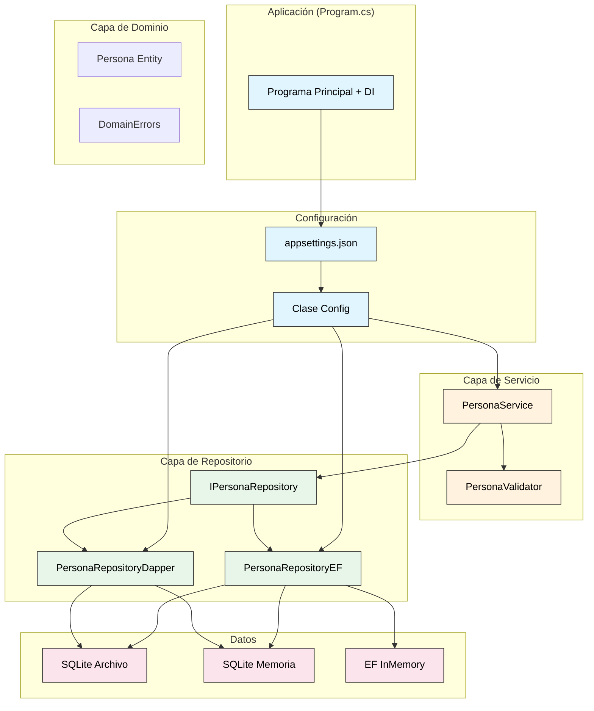
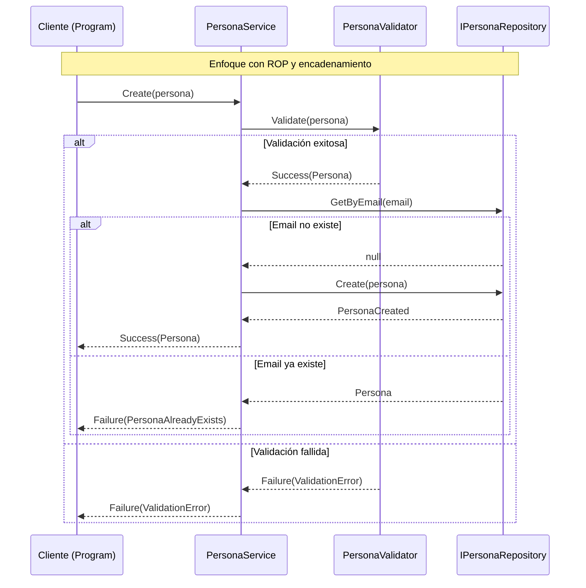

# Práctica 11: Sistema de Gestión de Personas con DI, Repository y ROP

- [11. Sistema de Gestión de Personas con DI, Repository y ROP](#11-sistema-de-gestión-de-personas-con-di-repository-y-rop)
  - [11.0. Librerías Necesarias](#110-librerías-necesarias)
  - [11.1. Descripción del Ejercicio](#111-descripción-del-ejercicio)
  - [11.2. Arquitectura y Diagrama](#112-arquitectura-y-diagrama)
  - [11.3. Errores de Dominio](#113-errores-de-dominio)
  - [11.4. Modelo de Datos](#114-modelo-de-datos)
  - [11.5. Interfaz del Repositorio](#115-interfaz-del-repositorio)
  - [11.6. Configuración (appsettings.json y Clase Config)](#116-configuración-appsettingsjson-y-clase-config)
  - [11.7. Datos de Demo (DemoData Factory)](#117-datos-de-demo-demodata-factory)
  - [11.8. DependenciesProvider (Inyección de Dependencias Centralizada)](#118-dependenciesprovider-inyección-de-dependencias-centralizada)
  - [11.9. Validador con ROP](#119-validador-con-rop)
  - [11.10. Implementación del Repositorio con EF Core](#1110-implementación-del-repositorio-con-ef-core)
    - [11.10.1. DbContext](#11101-dbcontext)
    - [11.10.2. Repositorio EF Core](#11102-repositorio-ef-core)
  - [11.11. Implementación del Repositorio con Dapper](#1111-implementación-del-repositorio-con-dapper)
  - [11.12. Servicio con Inyección de Dependencias y ROP](#1112-servicio-con-inyección-de-dependencias-y-rop)
  - [11.13. Programa Principal con DI Automatizado](#1113-programa-principal-con-di-automatizado)
  - [11.14. Consulta LINQ sobre Resultados](#1114-consulta-linq-sobre-resultados)

---

## 11.0. Librerías Necesarias

Para este proyecto necesitas instalar los siguientes paquetes NuGet:

```bash
# Paquetes base de .NET
dotnet add package Microsoft.Extensions.DependencyInjection
dotnet add package Microsoft.Extensions.Configuration
dotnet add package Microsoft.Extensions.Configuration.Json

# Entity Framework Core
dotnet add package Microsoft.EntityFrameworkCore
dotnet add package Microsoft.EntityFrameworkCore.Sqlite
dotnet add package Microsoft.EntityFrameworkCore.InMemory

# Dapper
dotnet add package Dapper
dotnet add package Microsoft.Data.Sqlite

# Railway Oriented Programming
dotnet add package CSharpFunctionalExtensions
```

### Resumen de paquetes:

| Paquete | Propósito |
|---------|-----------|
| `Microsoft.Extensions.DependencyInjection` | Contenedor de DI nativo de .NET |
| `Microsoft.Extensions.Configuration` | Lectura de configuración |
| `Microsoft.Extensions.Configuration.Json` | Lectura de appsettings.json |
| `Microsoft.EntityFrameworkCore` | ORM principal |
| `Microsoft.EntityFrameworkCore.Sqlite` | Proveedor SQLite para EF Core |
| `Microsoft.EntityFrameworkCore.InMemory` | Base de datos en memoria para testing |
| `Dapper` | Micro-ORM ligero |
| `Microsoft.Data.Sqlite` | Driver SQLite para Dapper |
| `CSharpFunctionalExtensions` | Librería ROP para Result |

---

## 11.1. Descripción del Ejercicio

En este ejercicio vamos a construir un **sistema de gestión de personas** completo que integra todos los conceptos vistos en la unidad:

- **Patrón Repository**: Abstraemos el acceso a datos detrás de una interfaz
- **Dos implementaciones**: EF Core y Dapper (intercambiables mediante DI)
- **Validación con ROP**: Railway Oriented Programming para manejo de errores elegante
- **Inyección de Dependencias**: Contenedor nativo de .NET para automatizar DI
- **Configuración externa**: Mediante appsettings.json y clase Config
- **Múltiples tipos de BD**: SQLite archivo, SQLite memoria, InMemory
- **Consultas LINQ**: Sobre los resultados obtenidos

### Requisitos del Sistema

1. **Entidad Persona**: id (autonumérico), nombre, email
2. **Validador**: Devuelve `Result` con errores de dominio si los datos son inválidos
3. **Repositorio**: Interfaz ICrudRepository con dos implementaciones (EF Core y Dapper)
4. **Servicio**: Usa el validador y el repositorio, devuelve `Result` al usuario
5. **Configuración**: En appsettings.json indicamos tipo de BD, implementación y modo desarrollo
6. **Modo Development**: Si está enabled, se borran los datos al iniciar

> 📝 **Nota del Profesor**: Este ejercicio demuestra la potencia de la inyección de dependencias. El servicio no sabe (ni le importa) si usa EF Core o Dapper. ¡Solo conoce la interfaz!

---

## 11.2. Arquitectura y Diagrama

### 11.2.1. Diagrama de Componentes



### 11.2.2. Flujo de Datos con ROP



> 💡 **Concepto Clave**: El `appsettings.json` configura el tipo de base de datos y el proveedor. ¡Sin cambiar código, podemos cambiar entre SQLite archivo, SQLite memoria o InMemory!

---

## 11.3. Errores de Dominio

Jerarquía de errores para el dominio de personas:

```csharp
namespace GestionPersonas.Domain.Errors;

public abstract class DomainError
{
    public string Message { get; }
    
    protected DomainError(string message) => Message = message;
}

public class ValidationError : DomainError
{
    public ValidationError(string message) : base(message) { }
}

public class PersonaNotFoundError : DomainError
{
    public int Id { get; }
    
    public PersonaNotFoundError(int id) 
        : base($"No se encontró la persona con ID {id}") 
        => Id = id;
}

public class PersonaAlreadyExistsError : DomainError
{
    public string Email { get; }
    
    public PersonaAlreadyExistsError(string email) 
        : base($"Ya existe una persona con el email {email}") 
        => Email = email;
}

public class StorageError : DomainError
{
    public Exception Exception { get; }
    
    public StorageError(Exception ex) 
        : base($"Error de almacenamiento: {ex.Message}") 
        => Exception = ex;
}
```

---

## 11.4. Modelo de Datos

Entidad Persona con Data Annotations:

```csharp
using System.ComponentModel.DataAnnotations;
using System.ComponentModel.DataAnnotations.Schema;

namespace GestionPersonas.Domain.Entities;

[Table("Personas")]
public class Persona
{
    [Key]
    [DatabaseGenerated(DatabaseGeneratedOption.Identity)]
    public int Id { get; set; }
    
    [Required]
    [MaxLength(100)]
    public string Nombre { get; set; } = string.Empty;
    
    [Required]
    [MaxLength(200)]
    [EmailAddress]
    [Index(IsUnique = true)]
    public string Email { get; set; } = string.Empty;
    
    [Index]
    public DateTime CreatedAt { get; set; }
    
    [Index]
    public DateTime UpdatedAt { get; set; }
    
    [Column("IsDeleted")]
    [Index]
    public bool IsDeleted { get; set; }
    
    public DateTime? DeletedAt { get; set; }
}
```

---

## 11.5. Interfaz del Repositorio

```csharp
namespace GestionPersonas.Domain.Repositories;

public interface ICrudRepository<TKey, TEntity> where TEntity : class
{
    IEnumerable<TEntity> GetAll();
    TEntity? GetById(TKey id);
    TEntity? Create(TEntity entity);
    TEntity? Update(TKey id, TEntity entity);
    TEntity? Delete(TKey id);
    void Initialize();
    void SeedData();
}

public interface IPersonaRepository : ICrudRepository<int, Persona>
{
    Persona? GetByEmail(string email);
}
```

---

## 11.6. Configuración (appsettings.json y Clase Config)

### 11.6.1. Ejemplos de appsettings.json

Puedes configurar la aplicación para usar diferentes proveedores de base de datos. ¡Solo cambia el archivo y listo!

#### Ejemplo 1: EF Core con SQLite archivo (persistente)

```json
{
  "Database": {
    "Provider": "EfCoreSqlite",
    "ConnectionString": "Data Source=personas.db"
  },
  "Development": {
    "Enabled": true,
    "SeedData": true
  },
  "Logging": {
    "LogLevel": {
      "Default": "Information"
    }
  }
}
```

#### Ejemplo 2: EF Core con SQLite en memoria (para desarrollo rápido)

```json
{
  "Database": {
    "Provider": "EfCoreSqliteMemory",
    "ConnectionString": "Data Source=personas_memoria.db"
  },
  "Development": {
    "Enabled": true,
    "SeedData": true
  },
  "Logging": {
    "LogLevel": {
      "Default": "Information"
    }
  }
}
```

#### Ejemplo 3: EF Core InMemory (ideal para testing)

```json
{
  "Database": {
    "Provider": "EfCoreInMemory",
    "InMemoryName": "PersonasDB_Test"
  },
  "Development": {
    "Enabled": false,
    "SeedData": false
  },
  "Logging": {
    "LogLevel": {
      "Default": "Warning"
    }
  }
}
```

#### Ejemplo 4: Dapper con SQLite archivo (máximo rendimiento)

```json
{
  "Database": {
    "Provider": "DapperSqlite",
    "ConnectionString": "Data Source=personas_dapper.db"
  },
  "Development": {
    "Enabled": true,
    "SeedData": true
  },
  "Logging": {
    "LogLevel": {
      "Default": "Information"
    }
  }
}
```

#### Ejemplo 5: Dapper con SQLite en memoria (para testing)

```json
{
  "Database": {
    "Provider": "DapperSqliteMemory",
    "ConnectionString": ":memory:"
  },
  "Development": {
    "Enabled": true,
    "SeedData": true
  },
  "Logging": {
    "LogLevel": {
      "Default": "Information"
    }
  }
}
```

#### Ejemplo 6: Producción (sin datos de prueba)

```json
{
  "Database": {
    "Provider": "EfCoreSqlite",
    "ConnectionString": "/var/data/personas.db"
  },
  "Development": {
    "Enabled": false,
    "SeedData": false
  },
  "Logging": {
    "LogLevel": {
      "Default": "Warning",
      "Microsoft": "Error"
    }
  }
}
```

### Valores posibles para `Provider`:

| Provider | Tecnología | Tipo | Uso recomendado |
|----------|------------|------|------------------|
| `"EfCoreSqlite"` | EF Core + SQLite archivo | Archivo | Desarrollo y producción |
| `"EfCoreSqliteMemory"` | EF Core + SQLite memoria | Memoria | Desarrollo rápido |
| `"EfCoreInMemory"` | EF Core InMemory | Memoria | Testing |
| `"DapperSqlite"` | Dapper + SQLite archivo | Archivo | Máximo rendimiento |
| `"DapperSqliteMemory"` | Dapper + SQLite memoria | Memoria | Testing |

> 💡 **Tip**: Cambia solo el `Provider` y la `ConnectionString` para usar una base de datos diferente. No necesitas tocar el código!

### 11.6.2. Clase de Configuración con Valores por Defecto

```csharp
using Microsoft.Extensions.Configuration;

namespace GestionPersonas.Config;

public static class AppConfig
{
    private static readonly IConfiguration Config;
    
    static AppConfig()
    {
        // Si no existe appsettings.json, crea uno con valores por defecto
        var configPath = Path.Combine(AppDomain.CurrentDomain.BaseDirectory, "appsettings.json");
        if (!File.Exists(configPath))
        {
            var defaultConfig = @"{
  ""Database"": {
    ""Provider"": ""EfCoreSqlite"",
    ""ConnectionString"": ""Data Source=personas.db"",
    ""InMemoryName"": ""PersonasDB""
  },
  ""Development"": {
    ""Enabled"": true,
    ""SeedData"": true
  }
}";
            File.WriteAllText(configPath, defaultConfig);
        }
        
        Config = new ConfigurationBuilder()
            .SetBasePath(AppDomain.CurrentDomain.BaseDirectory)
            .AddJsonFile("appsettings.json", optional: false, reloadOnChange: true)
            .Build();
    }
    
    public static string DatabaseProvider => 
        Config.GetValue<string>("Database:Provider") ?? "EfCoreSqlite";
    
    public static string ConnectionString => 
        Config.GetValue<string>("Database:ConnectionString") ?? "Data Source=personas.db";
    
    public static string InMemoryName => 
        Config.GetValue<string>("Database:InMemoryName") ?? "PersonasDB";
    
    public static bool IsDevelopment => 
        Config.GetValue<bool>("Development:Enabled");
    
    public static bool SeedData => 
        Config.GetValue<bool>("Development:SeedData");
    
    // Método para validar que el provider es válido
    public static bool IsValidProvider(string provider)
    {
        return provider switch
        {
            "EfCoreSqlite" or "EfCoreSqliteMemory" or "EfCoreInMemory" 
                or "DapperSqlite" or "DapperSqliteMemory" => true,
            _ => false
        };
    }
}
```

> 📝 **Nota del Profesor**: La clase `AppConfig` tiene valores por defecto seguros. Si no existe `appsettings.json`, lo crea automáticamente. Si falta alguna clave, usa valores por defecto:
> - **Provider**: `"EfCoreSqlite"` (el más común)
> - **ConnectionString**: `"Data Source=personas.db"`
> - **InMemoryName**: `"PersonasDB"`
> - **Development.Enabled**: `false` (si no existe, no hace seed)
> - **Development.SeedData**: `false` (si no existe, no hace seed)

---

## 11.7. Datos de Demo (DemoData Factory)

```csharp
namespace GestionPersonas.Data;

public static class DemoData
{
    public static IEnumerable<Domain.Entities.Persona> GetPersonasDemo()
    {
        return new List<Domain.Entities.Persona>
        {
            new() { Nombre = "Ana García", Email = "ana@correo.com" },
            new() { Nombre = "Carlos López", Email = "carlos@correo.com" },
            new() { Nombre = "María Rodríguez", Email = "maria@correo.com" },
            new() { Nombre = "Pedro Martínez", Email = "pedro@correo.com" },
            new() { Nombre = "Laura Fernández", Email = "laura@correo.com" }
        };
    }
}
```

> 📝 **Nota del Profesor**: Los datos de demo están en una clase estática `DemoData`. El repositorio los usará automáticamente según la configuración de `Development.SeedData`.

---

## 11.8. DependenciesProvider (Inyección de Dependencias Centralizada)

```csharp
// Microsoft.Extensions.DependencyInjection -> Contenedor DI
// Microsoft.EntityFrameworkCore.Sqlite -> EF Core con SQLite
// Dapper -> Micro-ORM ligero
using Microsoft.EntityFrameworkCore;
using Microsoft.Data.Sqlite;
using Microsoft.Extensions.DependencyInjection;
using GestionPersonas.Config;
using GestionPersonas.Domain.Repositories;
using GestionPersonas.Domain.Validators;
using GestionPersonas.Services;
using GestionPersonas.Data.EfCore;
using GestionPersonas.Data.Dapper;

namespace GestionPersonas.Infrastructure;

// Centraliza el registro de servicios de la aplicación
public static class DependenciesProvider
{
    // Método extensión para registrar servicios en IServiceCollection
    public static IServiceCollection AddServices(this IServiceCollection services)
    {
        // Seleccionar implementación según configuración (Factory Pattern)
        switch (AppConfig.DatabaseProvider)
        {
            case "EfCoreSqlite":
                // EF Core con SQLite archivo -> persiste datos
                services.AddDbContext<AppDbContext>(options =>
                {
                    options.UseSqlite(AppConfig.ConnectionString);
                });
                services.AddScoped<IPersonaRepository, PersonaRepositoryEf>();
                break;
                
            case "EfCoreSqliteMemory":
                // EF Core con SQLite en memoria -> rápido pero no persiste
                services.AddDbContext<AppDbContext>(options =>
                {
                    options.UseSqlite(":memory:");
                });
                services.AddScoped<IPersonaRepository, PersonaRepositoryEf>();
                break;
                
            case "EfCoreInMemory":
                // EF Core InMemory -> para testing
                services.AddDbContext<AppDbContext>(options =>
                {
                    options.UseInMemoryDatabase(AppConfig.InMemoryName);
                });
                services.AddScoped<IPersonaRepository, PersonaRepositoryEf>();
                break;
                
            case "DapperSqlite":
                // Dapper con SQLite archivo -> máximo rendimiento
                services.AddScoped<SqliteConnection>(_ => 
                    new SqliteConnection(AppConfig.ConnectionString));
                services.AddScoped<IPersonaRepository, PersonaRepositoryDapper>();
                break;
                
            case "DapperSqliteMemory":
                // Dapper con SQLite memoria -> Singleton para mantener datos
                services.AddSingleton<SqliteConnection>(_ => 
                {
                    var conn = new SqliteConnection(":memory:");
                    conn.Open();
                    return conn;
                });
                services.AddScoped<IPersonaRepository, PersonaRepositoryDapper>();
                break;
                
            default:
                Console.WriteLine($"⚠️ Proveedor desconocido: {AppConfig.DatabaseProvider}");
                Console.WriteLine($"⚠️ Usando EfCoreSqlite por defecto");
                services.AddDbContext<AppDbContext>(options =>
                {
                    options.UseSqlite(AppConfig.ConnectionString);
                });
                services.AddScoped<IPersonaRepository, PersonaRepositoryEf>();
                break;
        }
        
        // Registrar servicios de aplicación
        services.AddTransient<PersonaValidator>();
        services.AddTransient<IPersonaService, PersonaService>();
        
        return services;
    }
    
    public static IServiceProvider BuildServiceProvider()
    {
        var services = new ServiceCollection();
        services.AddServices();
        return services.BuildServiceProvider();
    }
}
```

> ⚠️ **CRÍTICO - Diferencias en uso de memoria**:
> | Provider | Lifetime | Razón |
> |----------|----------|-------|
> | `EfCoreSqlite` | Scoped ✅ | EF gestiona conexión |
> | `EfCoreSqliteMemory` | Scoped ✅ | EF gestiona internamente |
> | `EfCoreInMemory` | Scoped ✅ | EF gestiona internamente |
> | `DapperSqlite` | Scoped ✅ | Conexión por request |
> | `DapperSqliteMemory` | **Singleton ⚠️** | SQLite :memory: pierde datos si se cierra |

> 💡 **Recordatorio**: SQLite `:memory:` **no persiste**. Dapper necesita **Singleton** para mantener datos. EF Core lo gestiona automáticamente.

---

## 11.9. Validador con ROP

```csharp
using CSharpFunctionalExtensions;
using GestionPersonas.Domain.Errors;
using GestionPersonas.Domain.Entities;

namespace GestionPersonas.Domain.Validators;

public class PersonaValidator
{
    public Result<Persona, DomainError> Validate(Persona persona)
    {
        if (string.IsNullOrWhiteSpace(persona.Nombre))
            return Result.Failure<Persona, DomainError>(
                new ValidationError("El nombre es obligatorio"));
        
        if (persona.Nombre.Length < 2)
            return Result.Failure<Persona, DomainError>(
                new ValidationError("El nombre debe tener al menos 2 caracteres"));
        
        if (string.IsNullOrWhiteSpace(persona.Email))
            return Result.Failure<Persona, DomainError>(
                new ValidationError("El email es obligatorio"));
        
        if (!IsValidEmail(persona.Email))
            return Result.Failure<Persona, DomainError>(
                new ValidationError("El formato del email no es válido"));
        
        return Result.Success<Persona, DomainError>(persona);
    }
    
    private bool IsValidEmail(string email)
    {
        return email.Contains('@') && email.Contains('.');
    }
}
```

---

## 11.10. Implementación del Repositorio con EF Core

### 11.10.1. DbContext

```csharp
using Microsoft.EntityFrameworkCore;
using GestionPersonas.Domain.Entities;

namespace GestionPersonas.Data.EfCore;

public class AppDbContext : DbContext
{
    public DbSet<Persona> Personas { get; set; } = null!;
    
    public AppDbContext(DbContextOptions<AppDbContext> options) 
        : base(options) { }
}
```

### 11.10.2. Repositorio EF Core

```csharp
using Microsoft.EntityFrameworkCore;
using GestionPersonas.Domain.Entities;
using GestionPersonas.Domain.Repositories;
using GestionPersonas.Config;
using GestionPersonas.Data;

namespace GestionPersonas.Data.EfCore;

public class PersonaRepositoryEf(AppDbContext context) : IPersonaRepository
{
    public IEnumerable<Persona> GetAll()
    {
        return context.Personas
            .Where(p => !p.IsDeleted)
            .OrderBy(p => p.Nombre)
            .ToList();
    }
    
    public Persona? GetById(int id)
    {
        return context.Personas
            .FirstOrDefault(p => p.Id == id && !p.IsDeleted);
    }
    
    public Persona? GetByEmail(string email)
    {
        return context.Personas
            .FirstOrDefault(p => p.Email == email && !p.IsDeleted);
    }
    
    public Persona? Create(Persona persona)
    {
        persona.CreatedAt = DateTime.Now;
        persona.UpdatedAt = DateTime.Now;
        persona.IsDeleted = false;
        
        context.Personas.Add(persona);
        context.SaveChanges();
        
        return persona;
    }
    
    public Persona? Update(int id, Persona persona)
    {
        var existente = context.Personas.Find(id);
        
        if (existente == null || existente.IsDeleted)
            return null;
        
        existente.Nombre = persona.Nombre;
        existente.Email = persona.Email;
        existente.UpdatedAt = DateTime.Now;
        
        context.SaveChanges();
        return existente;
    }
    
    public Persona? Delete(int id)
    {
        var persona = context.Personas.Find(id);
        
        if (persona == null || persona.IsDeleted)
            return null;
        
        persona.IsDeleted = true;
        persona.DeletedAt = DateTime.Now;
        persona.UpdatedAt = DateTime.Now;
        
        context.SaveChanges();
        return persona;
    }
    
    public void Initialize()
    {
        if (AppConfig.IsDevelopment)
        {
            context.Database.EnsureDeleted();
        }
        context.Database.EnsureCreated();
    }
    
    public void SeedData()
    {
        if (AppConfig.SeedData && !context.Personas.Any())
        {
            context.Personas.AddRange(DemoData.GetPersonasDemo());
            context.SaveChanges();
        }
    }
}
```

---

## 11.11. Implementación del Repositorio con Dapper

### 11.11.1. Repositorio Dapper

```csharp
using Dapper;
using Microsoft.Data.Sqlite;
using GestionPersonas.Domain.Entities;
using GestionPersonas.Domain.Repositories;
using GestionPersonas.Config;
using GestionPersonas.Data;

namespace GestionPersonas.Data.Dapper;

public class PersonaRepositoryDapper(SqliteConnection connection) : IPersonaRepository
{
    public IEnumerable<Persona> GetAll()
    {
        const string sql = @"
            SELECT Id, Nombre, Email, CreatedAt, UpdatedAt, IsDeleted, DeletedAt 
            FROM Personas 
            WHERE IsDeleted = 0 
            ORDER BY Nombre";
        
        return connection.Query<Persona>(sql);
    }
    
    public Persona? GetById(int id)
    {
        const string sql = @"
            SELECT Id, Nombre, Email, CreatedAt, UpdatedAt, IsDeleted, DeletedAt 
            FROM Personas 
            WHERE Id = @Id AND IsDeleted = 0";
        
        return connection.QueryFirstOrDefault<Persona>(sql, new { Id = id });
    }
    
    public Persona? GetByEmail(string email)
    {
        const string sql = @"
            SELECT Id, Nombre, Email, CreatedAt, UpdatedAt, IsDeleted, DeletedAt 
            FROM Personas 
            WHERE Email = @Email AND IsDeleted = 0";
        
        return connection.QueryFirstOrDefault<Persona>(sql, new { Email = email });
    }
    
    public Persona? Create(Persona persona)
    {
        const string sql = @"
            INSERT INTO Personas (Nombre, Email, CreatedAt, UpdatedAt, IsDeleted)
            VALUES (@Nombre, @Email, @CreatedAt, @UpdatedAt, @IsDeleted);
            SELECT last_insert_rowid();";
        
        persona = persona with
        {
            CreatedAt = DateTime.Now,
            UpdatedAt = DateTime.Now,
            IsDeleted = false
        };
        
        var id = connection.ExecuteScalar<int>(sql, new
        {
            persona.Nombre,
            persona.Email,
            persona.CreatedAt,
            persona.UpdatedAt,
            persona.IsDeleted
        });
        
        persona.Id = id;
        return persona;
    }
    
    public Persona? Update(int id, Persona persona)
    {
        var existente = GetById(id);
        
        if (existente == null)
            return null;
        
        const string sql = @"
            UPDATE Personas 
            SET Nombre = @Nombre, Email = @Email, UpdatedAt = @UpdatedAt
            WHERE Id = @Id";
        
        connection.Execute(sql, new
        {
            Id = id,
            Nombre = persona.Nombre,
            Email = persona.Email,
            UpdatedAt = DateTime.Now
        });
        
        return GetById(id);
    }
    
    public Persona? Delete(int id)
    {
        var existente = GetById(id);
        
        if (existente == null)
            return null;
        
        const string sql = @"
            UPDATE Personas 
            SET IsDeleted = 1, DeletedAt = @DeletedAt, UpdatedAt = @UpdatedAt
            WHERE Id = @Id";
        
        connection.Execute(sql, new
        {
            Id = id,
            DeletedAt = DateTime.Now,
            UpdatedAt = DateTime.Now
        });
        
        return GetById(id);
    }
    
    public void Initialize()
    {
        if (AppConfig.IsDevelopment)
        {
            connection.Execute("DROP TABLE IF EXISTS Personas");
        }
        
        const string sql = @"
            CREATE TABLE IF NOT EXISTS Personas (
                Id INTEGER PRIMARY KEY AUTOINCREMENT,
                Nombre TEXT NOT NULL,
                Email TEXT NOT NULL UNIQUE,
                CreatedAt TEXT NOT NULL,
                UpdatedAt TEXT NOT NULL,
                IsDeleted INTEGER NOT NULL DEFAULT 0,
                DeletedAt TEXT
            )";
        
        connection.Execute(sql);
    }
    
    public void SeedData()
    {
        var count = connection.ExecuteScalar<int>("SELECT COUNT(*) FROM Personas");
        
        if (AppConfig.SeedData && count == 0)
        {
            foreach (var persona in DemoData.GetPersonasDemo())
            {
                Create(persona);
            }
        }
    }
}
```

---

## 11.12. Servicio con Inyección de Dependencias y ROP

Este servicio hace uso avanzado de ROP, encadenando operaciones:

```csharp
using CSharpFunctionalExtensions;
using GestionPersonas.Domain.Errors;
using GestionPersonas.Domain.Entities;
using GestionPersonas.Domain.Repositories;
using GestionPersonas.Domain.Validators;

namespace GestionPersonas.Services;

public interface IPersonaService
{
    Result<Persona, DomainError> Create(Persona persona);
    Result<Persona, DomainError> Update(int id, Persona persona);
    Result<Persona, DomainError> Delete(int id);
    Result<Persona, DomainError> GetById(int id);
    Result<Persona, DomainError> GetByEmail(string email);
    IEnumerable<Persona> GetAll();
    Result<IEnumerable<Persona>, DomainError> GetByInitial(char letter);
}

public class PersonaService(
    IPersonaRepository repository, 
    PersonaValidator validator) : IPersonaService
{
    public Result<Persona, DomainError> Create(Persona persona)
    {
        // Encadenamos: Validar -> Verificar email único -> Crear
        return validator.Validate(persona)
            .Bind(p => VerifyEmailUnique(p.Email))  // Bind encadena operaciones
            .Map(p => repository.Create(p)!);       // Map transforma el resultado
    }
    
    public Result<Persona, DomainError> Update(int id, Persona persona)
    {
        // Encadenamos: Obtener existente -> Validar -> Verificar email único -> Actualizar
        return GetById(id)
            .ToResult(new PersonaNotFoundError(id))
            .Bind(p => validator.Validate(persona))
            .Bind(p => VerifyEmailUniqueForUpdate(id, p.Email))
            .Map(p => repository.Update(id, persona)!);
    }
    
    public Result<Persona, DomainError> Delete(int id)
    {
        // Usando Bind para encadenar
        return GetById(id)
            .ToResult(new PersonaNotFoundError(id))
            .Map(p => repository.Delete(id)!);
    }
    
    public Result<Persona, DomainError> GetById(int id)
    {
        var persona = repository.GetById(id);
        
        // Operador ?? para convertir null a error
        return persona ?? Result.Failure<Persona, DomainError>(
            new PersonaNotFoundError(id));
    }
    
    public Result<Persona, DomainError> GetByEmail(string email)
    {
        var persona = repository.GetByEmail(email);
        
        return persona ?? Result.Failure<Persona, DomainError>(
            new ValidationError($"No se encontró ninguna persona con email {email}"));
    }
    
    public IEnumerable<Persona> GetAll()
    {
        return repository.GetAll();
    }
    
    public Result<IEnumerable<Persona>, DomainError> GetByInitial(char letter)
    {
        // Filtrar personas por inicial del nombre usando LINQ
        var personas = repository.GetAll()
            .Where(p => p.Nombre.StartsWith(letter, StringComparison.OrdinalIgnoreCase))
            .ToList();
        
        if (personas.Count == 0)
            return Result.Failure<IEnumerable<Persona>, DomainError>(
                new ValidationError($"No se encontraron personas que empiecen por '{letter}'"));
        
        return Result.Success<IEnumerable<Persona>, DomainError>(personas);
    }
    
    // Método privado para verificar email único usando Bind
    private Result<Persona, DomainError> VerifyEmailUnique(string email)
    {
        var existente = repository.GetByEmail(email);
        
        return existente != null
            ? Result.Failure<Persona, DomainError>(new PersonaAlreadyExistsError(email))
            : Result.Success<Persona, DomainError>(null!);
    }
    
    // Método privado para verificar email único (excluyendo un ID)
    private Result<string, DomainError> VerifyEmailUniqueForUpdate(int id, string email)
    {
        var existente = repository.GetByEmail(email);
        
        // Si no existe o es el mismo ID, está OK
        if (existente == null || existente.Id == id)
            return Result.Success<string, DomainError>(email);
        
        return Result.Failure<string, DomainError>(
            new PersonaAlreadyExistsError(email));
    }
}
```

> 📝 **Nota del Profesor**: Observa el uso avanzado de ROP:
> - **Bind**: Encadena operaciones que pueden fallar (devuelven Result)
> - **Map**: Transforma el valor en caso de éxito
> - **Operador ??**: Convierte null a Result de error
> - **ToResult**: Convierte un valor a Result, fallando si es null

---

## 11.13. Programa Principal con DI Automatizado

```csharp
using Microsoft.EntityFrameworkCore;
using Microsoft.Data.Sqlite;
using Microsoft.Extensions.Configuration;
using Microsoft.Extensions.DependencyInjection;
using CSharpFunctionalExtensions;
using GestionPersonas.Domain.Entities;
using GestionPersonas.Domain.Errors;
using GestionPersonas.Domain.Repositories;
using GestionPersonas.Domain.Validators;
using GestionPersonas.Services;
using GestionPersonas.Data.EfCore;
using GestionPersonas.Data.Dapper;
using GestionPersonas.Config;
using GestionPersonas.Infrastructure;

// ============================================
// CONFIGURACIÓN
// ============================================

Console.WriteLine($"=== Sistema de Gestión de Personas ===");
Console.WriteLine($"Proveedor: {AppConfig.DatabaseProvider}");
Console.WriteLine($"Desarrollo: {AppConfig.IsDevelopment}");
Console.WriteLine();

// ============================================
// INYECCIÓN DE DEPENDENCIAS AUTOMATIZADA
// ============================================

// Usar DependenciesProvider para registrar todos los servicios automáticamente
var serviceProvider = DependenciesProvider.BuildServiceProvider();

// ============================================
// INICIALIZACIÓN DE DATOS
// ============================================

// Inicializar repositorio - automáticamente usa datos de DemoData según configuración
var repository = serviceProvider.GetRequiredService<IPersonaRepository>();
repository.Initialize();
repository.SeedData();  // Inserta datos de DemoData si SeedData=true en config

// Obtener servicio
var service = serviceProvider.GetRequiredService<IPersonaService>();

Console.WriteLine("=== OPERACIONES ===");
Console.WriteLine();

// ============================================
// 1. OBTENER TODOS (GetAll - no retorna Result)
// ============================================

Console.WriteLine("1. Lista de todas las personas:");
var todas = service.GetAll();

foreach (var persona in todas)
{
    Console.WriteLine($"   {persona.Id}: {persona.Nombre} ({persona.Email})");
}

Console.WriteLine();

// ============================================
// 2. CONSULTAR POR ID (ROP)
// ============================================

Console.WriteLine("2. Buscar persona por ID = 1:");
var porId = service.GetById(1);

porId.Match(
    onSuccess: p => Console.WriteLine($"   ✓ Encontrada: {p.Nombre} - {p.Email}"),
    onFailure: e => Console.WriteLine($"   ✗ Error: {e.Message}")
);

Console.WriteLine();

// ============================================
// 3. CONSULTAR ID QUE NO EXISTE (ROP)
// ============================================

Console.WriteLine("3. Buscar persona por ID = 999:");
var noExiste = service.GetById(999);

noExiste.Match(
    onSuccess: p => Console.WriteLine($"   ✓ Encontrada: {p.Nombre}"),
    onFailure: e => Console.WriteLine($"   ✗ Error: {e.Message}")
);

Console.WriteLine();

// ============================================
// 4. CREAR PERSONA VÁLIDA (ROP con Bind y Map)
// ============================================

Console.WriteLine("4. Crear persona válida:");
var nueva = new Persona { Nombre = "Juan Torres", Email = "juan@correo.com" };
var crearOk = service.Create(nueva);

crearOk.Match(
    onSuccess: p => Console.WriteLine($"   ✓ Creada: ID={p.Id}, {p.Nombre}"),
    onFailure: e => Console.WriteLine($"   ✗ Error: {e.Message}")
);

Console.WriteLine();

// ============================================
// 5. CREAR CON EMAIL DUPLICADO (ROP)
// ============================================

Console.WriteLine("5. Crear persona con email duplicado:");
var duplicada = new Persona { Nombre = "Otro", Email = "ana@correo.com" };
var crearDup = service.Create(duplicada);

crearDup.Match(
    onSuccess: p => Console.WriteLine($"   ✓ Creada: {p.Nombre}"),
    onFailure: e => Console.WriteLine($"   ✗ Error: {e.Message}")
);

Console.WriteLine();

// ============================================
// 6. CREAR CON VALIDACIÓN FALLIDA (ROP)
// ============================================

Console.WriteLine("6. Crear persona con nombre vacío:");
var invalida = new Persona { Nombre = "", Email = "test@correo.com" };
var crearInv = service.Create(invalida);

crearInv.Match(
    onSuccess: p => Console.WriteLine($"   ✓ Creada: {p.Nombre}"),
    onFailure: e => Console.WriteLine($"   ✗ Error: {e.Message}")
);

Console.WriteLine();

// ============================================
// 7. ACTUALIZAR PERSONA (ROP encadenado)
// ============================================

Console.WriteLine("7. Actualizar persona ID = 2:");
var actualizar = service.Update(2, new Persona { Nombre = "Carlos Actualizado", Email = "carlos.new@correo.com" });

actualizar.Match(
    onSuccess: p => Console.WriteLine($"   ✓ Actualizada: {p.Nombre} ({p.Email})"),
    onFailure: e => Console.WriteLine($"   ✗ Error: {e.Message}")
);

Console.WriteLine();

// ============================================
// 8. ELIMINAR PERSONA (ROP)
// ============================================

Console.WriteLine("8. Eliminar persona ID = 3:");
var eliminar = service.Delete(3);

eliminar.Match(
    onSuccess: p => Console.WriteLine($"   ✓ Eliminada: {p.Nombre}"),
    onFailure: e => Console.WriteLine($"   ✗ Error: {e.Message}")
);

Console.WriteLine();

// ============================================
// 9. CONSULTAS LINQ SOBRE GetAll()
// ============================================

Console.WriteLine("9. Consultas LINQ sobre resultados:");

var personas = service.GetAll().ToList();

Console.WriteLine($"   - Total personas: {personas.Count}");

var conA = personas
    .Where(p => p.Nombre.Contains("a", StringComparison.OrdinalIgnoreCase))
    .ToList();
Console.WriteLine($"   - Personas con 'a': {conA.Count}");

var ordenadas = personas.OrderBy(p => p.Email).ToList();
Console.WriteLine($"   - Ordenadas por email: {ordenadas.First().Email}");

var nombresProyectados = personas
    .Select(p => $"{p.Nombre} <{p.Email}>")
    .ToList();
Console.WriteLine($"   - Primera proyectada: {nombresProyectados.First()}");

Console.WriteLine();

// ============================================
// 10. GetByInitial (ROP con colección)
// ============================================

Console.WriteLine("10. Personas que empiezan por 'A':");
var porA = service.GetByInitial('A');

porA.Match(
    onSuccess: lista => 
    {
        Console.WriteLine($"    - Encontradas: {lista.Count()}");
        foreach (var p in lista)
            Console.WriteLine($"    * {p.Nombre}");
    },
    onFailure: e => Console.WriteLine($"    ✗ Error: {e.Message}")
);

Console.WriteLine();
Console.WriteLine("=== FIN ===");
```

---

## 11.14. Consulta LINQ sobre Resultados

```csharp
// GetAll() devuelve IEnumerable<Persona> directamente
var personas = service.GetAll().ToList();

// Filtrar
var filtradas = personas.Where(p => p.Email.Contains("correo")).ToList();

// Transformar (Select)
var nombres = personas.Select(p => $"{p.Nombre} ({p.Email})").ToList();

// Ordenar
var ordenadas = personas.OrderBy(p => p.Nombre).ThenBy(p => p.Email).ToList();

// Aggregations
var total = personas.Count;
var conA = personas.Count(p => p.Nombre.Contains("a"));
var primera = personas.MinBy(p => p.Nombre)?.Nombre;

// Agrupación
var porDominio = personas
    .GroupBy(p => p.Email.Split('@').Last())
    .ToDictionary(g => g.Key, g => g.Count());

// Paginación
var pagina1 = personas.OrderBy(p => p.Nombre).Skip(0).Take(5).ToList();
```

> 📝 **Nota del Profesor**: `GetAll()` devuelve `IEnumerable<Persona>` directamente (no Result). Por eso podemos hacer LINQ directamente. Los métodos que pueden fallar (`GetById`, `Create`, etc.) devuelven `Result` para manejo elegante de errores.

---

## Resumen del Ejercicio

En este ejercicio hemos visto:

1. ✅ **Clase de configuración** que mapea appsettings.json con valores por defecto
2. ✅ **5 proveedores de BD**: EfCoreSqlite, EfCoreSqliteMemory, EfCoreInMemory, DapperSqlite, DapperSqliteMemory
3. ✅ **Inicialización automática** según configuración (modo desarrollo)
4. ✅ **DI automatizado** con ServiceCollection
5. ✅ **ROP avanzado** con Bind, Map, ?? y encadenamiento
6. ✅ **Consultas LINQ** sobre resultados de GetAll()

### Cómo funciona con cada configuración:

| Provider | Base de Datos | Inicialización | Persistencia |
|----------|---------------|----------------|--------------|
| `"EfCoreSqlite"` | SQLite archivo | `EnsureDeleted()` + `EnsureCreated()` | ✅ Sí |
| `"EfCoreSqliteMemory"` | SQLite memoria | `EnsureDeleted()` + `EnsureCreated()` | ❌ No |
| `"EfCoreInMemory"` | EF InMemory | `EnsureDeleted()` + `EnsureCreated()` | ❌ No |
| `"DapperSqlite"` | SQLite archivo | `DROP TABLE` + `CREATE TABLE` | ✅ Sí |
| `"DapperSqliteMemory"` | SQLite memoria | `DROP TABLE` + `CREATE TABLE` | ❌ No (usa Singleton) |

### Valores por defecto si falta configuración:

| Clave | Valor por defecto |
|-------|-------------------|
| `Database:Provider` | `"EfCoreSqlite"` |
| `Database:ConnectionString` | `"Data Source=personas.db"` |
| `Database:InMemoryName` | `"PersonasDB"` |
| `Development:Enabled` | `false` |
| `Development:SeedData` | `false` |

### Para cambiar de base de datos:

1. Cambia el valor de `"Provider"` en `appsettings.json`
2. Ejecuta la aplicación - ¡funcionará automáticamente!
3. Si el provider no es válido, usa `"EfCoreSqlite"` por defecto

¡El sistema es flexible y configurable sin cambiar código!

---

***

