- [12. Resumen](#12-resumen)


# 12. Resumen

## Resumen

Esta unidad ha cubierto los fundamentos del **acceso a bases de datos relacionales** en C# .NET, incluyendo:

1. **Fundamentos de BD**: Conceptos básicos, modelo relacional, restricciones
2. **ORM**: Mapeo objeto-relacional, qué es y por qué usarlo
3. **Diseño de Entidades**: Claves (autonumérico vs GUID), atributos de control, borrado lógico
4. **Tecnologías**: ADO.NET, Dapper, Entity Framework Core
5. **Tipos de BD**: SQLite archivo, SQLite memoria, EF Core InMemory
6. **Patrón Repository**: Implementaciones con ICrudRepository
7. **Inyección de Dependencias**: Principio DIP, contenedores, ciclos de vida
8. **Railway Oriented Programming**: El tipo Result, CSharpFunctionalExtensions
9. **Integración**: Sistema completo con DI, Repository y ROP

## Mapa Mental

```mermaid
graph TD
    UD09["UD09: Bases de Datos y Acceso a Datos"] --> FUNDAMENTOS["Fundamentos BD"]
    UD09 --> ORM["ORM"]
    UD09 --> DISENO["Diseño de Entidades"]
    UD09 --> TECNOLOGIAS["Tecnologías"]
    UD09 --> REPOSITORY["Patrón Repository"]
    UD09 --> DI["Inyección de Dependencias"]
    UD09 --> ROP["ROP"]
    
    FUNDAMENTOS --> TABLAS["Tablas"]
    FUNDAMENTOS --> CLAVES["Claves PK/FK"]
    FUNDAMENTOS --> INTEGRIDAD["Restricciones"]
    
    ORM --> EF["Entity Framework Core"]
    ORM --> IMPEDANCE["Impedance Mismatch"]
    
    DISENO --> AUTO["Autonumérico"]
    DISENO --> GUID["GUID"]
    DISENO --> AUDITORIA["Campos de auditoría"]
    DISENO --> BORRADO["Borrado lógico"]
    
    TECNOLOGIAS --> ADO["ADO.NET"]
    TECNOLOGIAS --> DAPPER["Dapper"]
    TECNOLOGIAS --> EFCORE["EF Core"]
    
    REPOSITORY --> IREPO["ICrudRepository"]
    REPOSITORY --> IMPL_ADO["Implementación ADO.NET"]
    REPOSITORY --> IMPL_DAPPER["Implementación Dapper"]
    REPOSITORY --> IMPL_EF["Implementación EF Core"]
    
    DI --> DIP["Principio DIP"]
    DI --> CONTENEDOR["Contenedor DI"]
    DI --> LIFETIME["Transient/Scoped/Singleton"]
    DI --> CONFIG["appsettings.json"]
    
    ROP --> RESULT["Tipo Result"]
    ROP --> CFUNC["CSharpFunctionalExtensions"]
    ROP --> OPERACIONES["Bind/Map/Ensure/Match"]
    
    style UD09 fill:#ff9900,color:#fff,stroke:#333,stroke-width:4px
```



## Checklist de Evaluación

### Fundamentos de BD
- [ ] Entiendo el modelo relacional (tablas, filas, columnas)
- [ ] Sé qué son las claves primarias y foráneas
- [ ] Conozco las restricciones de integridad (NOT NULL, UNIQUE, CHECK, FOREIGN KEY)

### ORM
- [ ] Sé qué es un ORM y por qué se usa
- [ ] Conozco el problema del Impedance Mismatch
- [ ] Sé qué es Entity Framework Core

### Diseño de Entidades
- [ ] Puedo explicar la diferencia entre clave autonumérica y GUID
- [ ] Sé cuándo usar cada tipo de clave
- [ ] Conozco los campos de auditoría (CreatedAt, UpdatedAt)
- [ ] Entiendo la diferencia entre borrado físico y lógico

### Tecnologías de Acceso a Datos
- [ ] Conozco la pirámide ADO.NET → Dapper → EF Core
- [ ] Sé escribir código con ADO.NET
- [ ] Sé usar Dapper para mapping automático
- [ ] Sé usar EF Core con Data Annotations

### Patrón Repository
- [ ] Puedo definir la interfaz ICrudRepository
- [ ] Sé implementar un repositorio con ADO.NET
- [ ] Sé implementar un repositorio con Dapper
- [ ] Sé implementar un repositorio con EF Core

### Tipos de Bases de Datos
- [ ] Sé usar SQLite en archivo
- [ ] Sé usar SQLite en memoria
- [ ] Sé usar EF Core InMemory
- [ ] Puedo cambiar de motor de BD sin modificar código de negocio

### Inyección de Dependencias
- [ ] Entiendo el Principio de Inversión de Dependencias
- [ ] Sé registrar servicios en .NET
- [ ] Conozco la diferencia entre Transient, Scoped y Singleton
- [ ] Sé cargar configuración desde appsettings.json

### Railway Oriented Programming
- [ ] Entiendo por qué las excepciones no son ideales para control de flujo
- [ ] Sé usar el tipo Result
- [ ] Conozco las operaciones Bind, Map, Ensure, Match
- [ ] Puedo encadenar operaciones con Result

## Tabla de Referencia Rápida

| Tema | Tecnología | Paquetes NuGet |
|------|-----------|-----------------|
| ADO.NET | SQLite | `Microsoft.Data.Sqlite` |
| Dapper | Mapping | `Dapper` + `Microsoft.Data.Sqlite` |
| EF Core | ORM | `Microsoft.EntityFrameworkCore` + `Microsoft.EntityFrameworkCore.Sqlite` |
| InMemory | Testing | `Microsoft.EntityFrameworkCore.InMemory` |
| ROP | Result | `CSharpFunctionalExtensions` |

## Comandos Útiles

```bash
# Instalar paquetes
dotnet add package Microsoft.Data.Sqlite
dotnet add package Dapper
dotnet add package Microsoft.EntityFrameworkCore.Sqlite
dotnet add package Microsoft.EntityFrameworkCore.InMemory
dotnet add package CSharpFunctionalExtensions

# Crear base de datos
context.Database.EnsureCreated()
context.Database.EnsureDeleted()
```

## 🎓 Nota del Profesor

Esta unidad cubre los fundamentos del acceso a datos en .NET. Desde el control básico con ADO.NET hasta la abstracción completa con EF Core, pasando por el balance ideal de Dapper.

**Recuerda:**
1. **Elige la herramienta adecuada**: No necesitas EF Core para todo
2. **Protege contra SQL Injection**: Siempre usa parámetros
3. **Diseña para el cambio**: Usa interfaces e inyección de dependencias
4. **Maneja errores correctamente**: Considera ROP en lugar de excepciones
5. **Usa borrado lógico por defecto**: Los datos son demasiado valiosos para borrar
