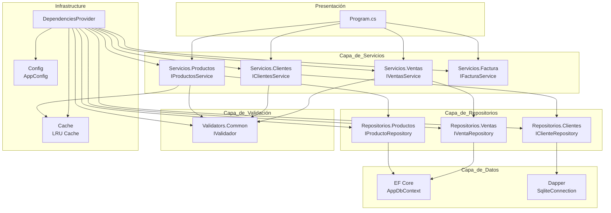
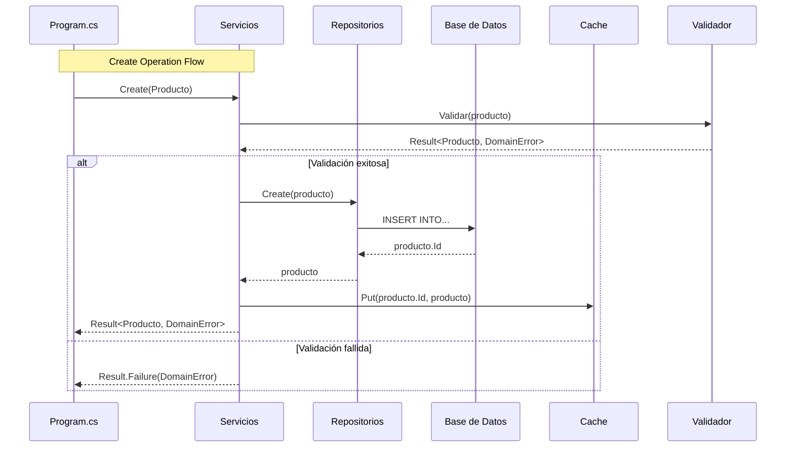
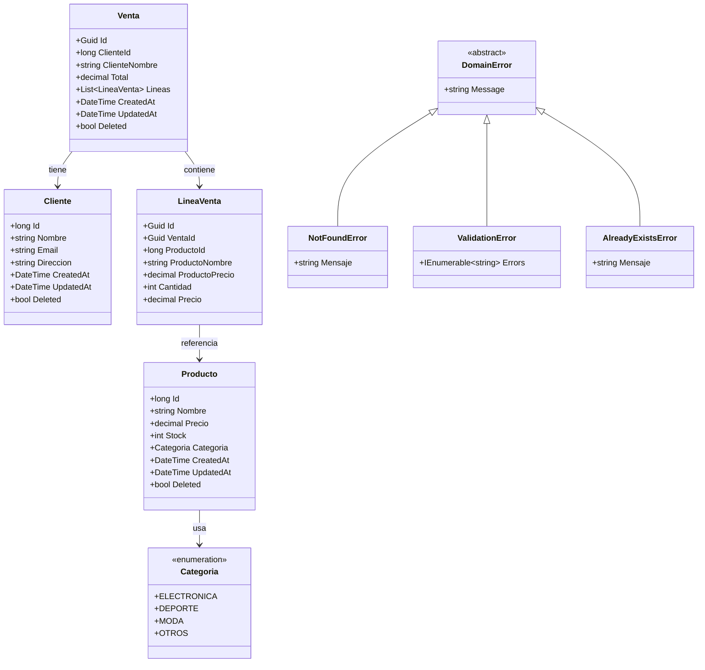
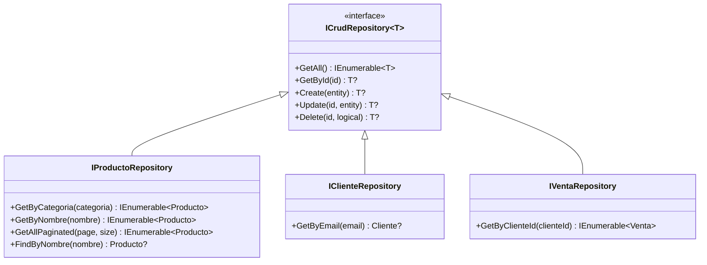
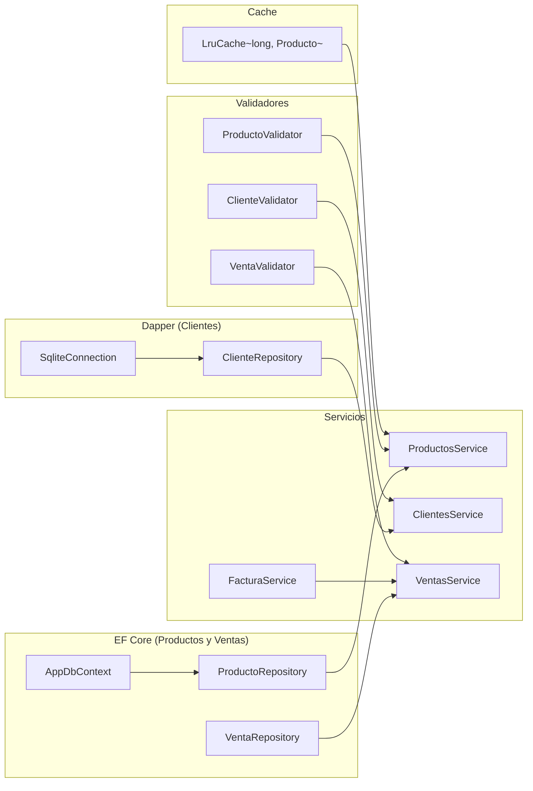
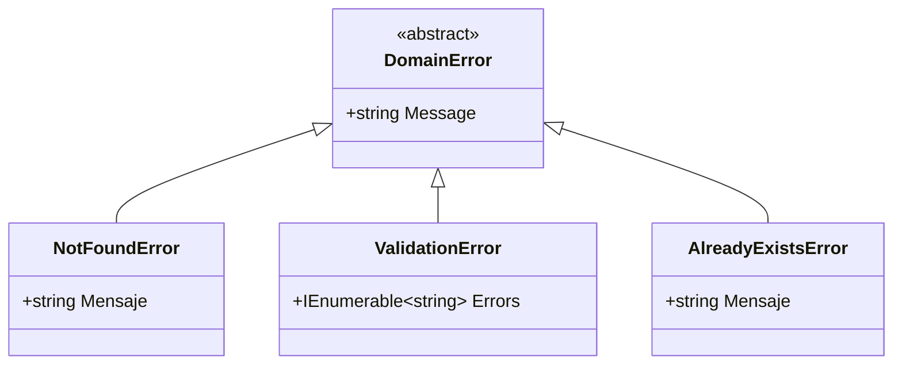
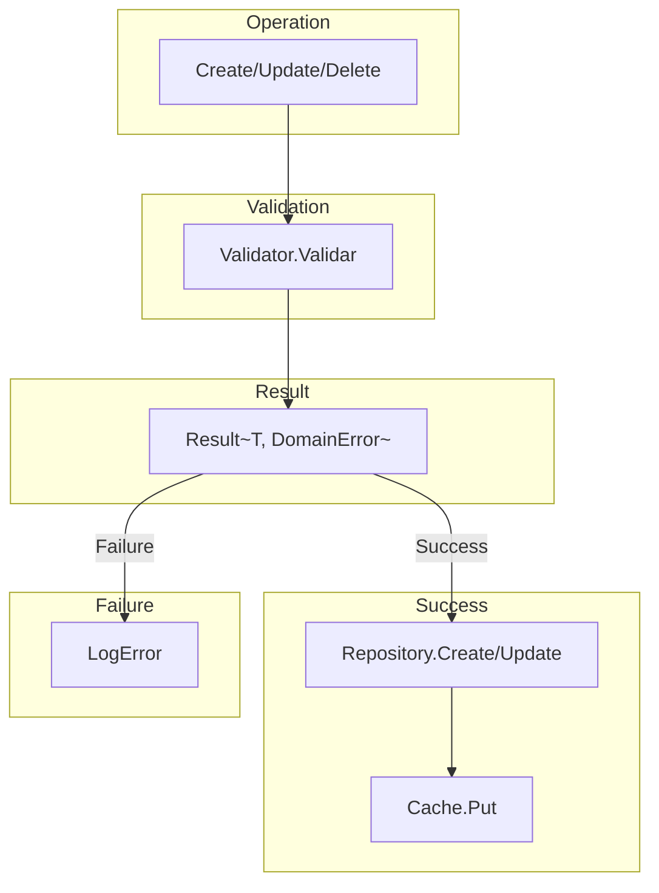
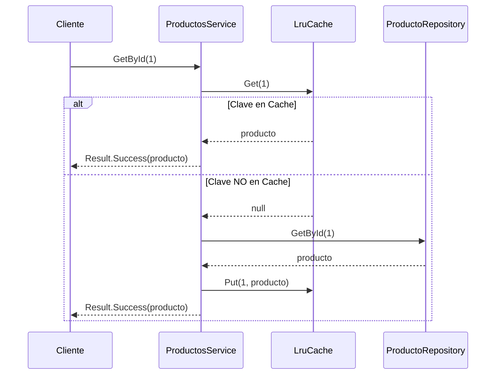
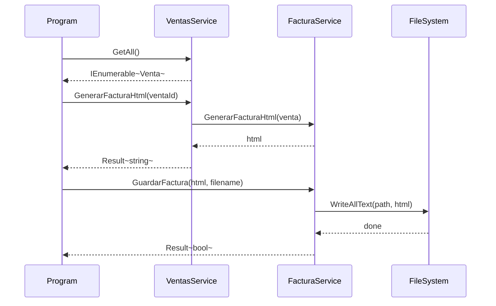

# CarroCompraService - Apuntes de Arquitectura

## Descripción del Proyecto

**CarroCompraService** es un servicio de gestión de un carrito de la compra desarrollado en .NET 10 que implementa una arquitectura limpia (Clean Architecture) con inyección de dependencias, programación funcional mediante el patrón Result, y acceso dual a datos usando Entity Framework Core y Dapper.

Este proyecto es un ejemplo educativo que demuestra cómo estructurar una aplicación empresarial con:
- **Patrón Repository** para abstraer el acceso a datos
- **CSharpFunctionalExtensions** para manejo de errores funcional
- **Inyección de dependencias** nativa de .NET
- **Cache LRU** para optimizar consultas frecuentes
- **Generación de facturas** en formato HTML
- **Validación** de entidades mediante el patrón Validator

---

## 1. Arquitectura General

### 1.1 Visión General del Sistema

El proyecto sigue una arquitectura por capas claramente diferenciada:

1. **Capa de Presentación**: Program.cs - punto de entrada de la aplicación
2. **Capa de Servicios**: Lógica de negocio (Productos, Clientes, Ventas, Facturas)
3. **Capa de Repositorios**: Abstracción del acceso a datos
4. **Capa de Datos**: Implementación concreta (EF Core para Productos/Ventas, Dapper para Clientes)
5. **Capa de Validación**: Reglas de negocio mediante validadores
6. **Infrastructure**: Configuración centralizada y cache

### 1.2 Diagrama de Componentes



### 1.3 Flujo de Datos entre Capas



---

## 2. Diagrama de Clases - Modelos de Dominio

### 2.1 Descripción de Entidades

A continuación se presentan las entidades principales del dominio:

- **Producto**: Representa un artículo disponible para venta con precio, stock y categoría
- **Cliente**: Cliente registrado en el sistema con datos de contacto
- **Venta**: Transacción de compra realizada por un cliente
- **LineaVenta**: Línea individual de una venta (producto + cantidad)
- **Categoria**: Enumeración de categorías de productos

### 2.2 Diagrama de Clases



---

## 3. Patrón Repository

### 3.1 Descripción del Patrón

El patrón Repository proporciona una abstracción sobre la capa de datos, permitiendo:
- Centralizar la lógica de acceso a datos
- Facilitar el testing mediante mocks
- Cambiar la implementación de acceso a datos sin modificar la lógica de negocio

### 3.2 Interfaz Genérica ICrudRepository



### 3.3 Implementaciones Específicas

| Repositorio | Tecnología | Entidades |
|-------------|------------|-----------|
| ProductoRepository | EF Core | Producto |
| ClienteRepository | Dapper | Cliente |
| VentaRepository | EF Core | Venta, LineaVenta |

---

## 4. Inyección de Dependencias

### 4.1 Descripción

El proyecto utiliza el contenedor DI nativo de .NET (Microsoft.Extensions.DependencyInjection) gestionado centralmente por la clase DependenciesProvider. Esta clase registra todas las dependencias al inicio de la aplicación.

### 4.2 Registro de Servicios



---

## 5. Manejo de Errores con Result

### 5.1 Descripción del Patrón

El proyecto utiliza CSharpFunctionalExtensions para implementar el patrón Result (también conocido como Either). Este patrón permite:
- Encadenar operaciones que pueden fallar
- Diferenciar claramente entre éxito y error
- Evitar excepciones para flujo de control
- Tipado seguro de errores

### 5.2 Tipos de DomainError



### 5.3 Flujo de Operaciones con Result



---

## 6. Sistema de Cache LRU

### 6.1 Descripción

Se implementa una caché LRU (Least Recently Used) para optimizar las consultas de productos por ID. La caché tiene un tamaño configurable y almacena los productos más recientemente accedidos.

### 6.2 Diagrama de Secuencia



### 6.3 Configuración

El tamaño de la caché se configura en appsettings.json:
```json
"Cache": {
  "Size": 10
}
```

---

## 7. Generación de Facturas

### 7.1 Descripción

El servicio de facturas genera documentos HTML con formato profesional que incluyen:
- Información de la tienda (configurable)
- Datos del cliente
- Línea de productos comprados
- Total de la compra

### 7.2 Diagrama de Secuencia



### 7.3 Configuración de Factura

```json
"Factura": {
  "Directory": "Facturas",
  "TiendaNombre": "Tienda Programacion 1DAW",
  "TiendaDireccion": "IES Luis Vives, Leganés"
}
```

---

## 8. Estructura de Proyecto

```
CarroCompraService/
├── Cache/
│   ├── ICache.cs          # Interfaz de caché
│   └── LruCache.cs        # Implementación LRU
├── Config/
│   └── AppConfig.cs       # Configuración centralizada
├── Data/
│   └── AppDbContext.cs    # Contexto EF Core
├── Errors/
│   └── DomainError.cs     # Errores de dominio
├── Extensions/
│   └── MaybeExtensions.cs # Extensiones para Maybe
├── Factories/
│   ├── ClienteFactory.cs  # Datos de prueba clientes
│   └── ProductoFactory.cs # Datos de prueba productos
├── Infrastructure/
│   └── DependenciesProvider.cs # Registro de DI
├── Models/
│   ├── Clientes/
│   │   └── Cliente.cs     # Entidad Cliente
│   ├── Productos/
│   │   ├── Categoria.cs  # Enumeración categorías
│   │   └── Producto.cs   # Entidad Producto
│   └── Ventas/
│       ├── LineaVenta.cs # Línea de venta
│       └── Venta.cs       # Entidad Venta
├── Repositories/
│   ├── Clientes/
│   │   ├── ClienteRepository.cs    # Dapper
│   │   └── IClienteRepository.cs
│   ├── Common/
│   │   └── ICrudRepository.cs     # Interfaz genérica
│   ├── Productos/
│   │   ├── IProductoRepository.cs
│   │   └── ProductoRepository.cs   # EF Core
│   └── Ventas/
│       ├── IVentaRepository.cs
│       └── VentaRepository.cs      # EF Core
├── Services/
│   ├── Clientes/
│   │   ├── ClientesService.cs
│   │   └── IClientesService.cs
│   ├── Factura/
│   │   ├── FacturaService.cs
│   │   └── IFacturaService.cs
│   ├── Productos/
│   │   ├── IProductosService.cs
│   │   └── ProductosService.cs
│   └── Ventas/
│       ├── IVentasService.cs
│       └── VentasService.cs
├── Validators/
│   ├── Clientes/
│   │   └── ClienteValidator.cs
│   ├── Common/
│   │   └── IValidador.cs
│   ├── Productos/
│   │   └── ProductoValidator.cs
│   └── Ventas/
│       └── VentaValidator.cs
├── appsettings.json       # Configuración
└── Program.cs             # Punto de entrada
```

---

## 9. Configuración (appsettings.json)

```json
{
  "Database": {
    "Provider": "EfCoreSqlite",
    "ConnectionString": "Data Source=carrocompra.db",
    "CreateTable": true,
    "DropData": true,
    "SeedData": true
  },
  "Cache": {
    "Size": 10
  },
  "Factura": {
    "Directory": "Facturas",
    "TiendaNombre": "Tienda Programacion 1DAW",
    "TiendaDireccion": "IES Luis Vives, Leganés"
  },
  "Development": {
    "Enabled": true
  },
  "Logging": {
    "LogLevel": {
      "Default": "Information",
      "Microsoft": "Warning",
      "Microsoft.EntityFrameworkCore": "Warning"
    }
  }
}
```

### Descripción de Configuración

- **Database.Provider**: Proveedor de base de datos (EfCoreSqlite o DapperSqlite)
- **Database.ConnectionString**: Ruta del archivo SQLite
- **Database.CreateTable**: Crear tablas al iniciar
- **Database.DropData**: Borrar datos al iniciar (desarrollo)
- **Database.SeedData**: Insertar datos de prueba
- **Cache.Size**: Tamaño máximo de la caché LRU
- **Factura.Directorio**: Carpeta donde se guardan las facturas
- **Factura.TiendaNombre**: Nombre de la tienda en las facturas
- **Factura.TiendaDireccion**: Dirección en las facturas

---

## 10. Patrones y Principios Aplicados

### SOLID

| Principio | Aplicación |
|-----------|------------|
| **S**ingle Responsibility | Cada clase tiene una responsabilidad única |
| **O**pen/Closed | Extensible sin modificar código existente |
| **L**iskov Substitution | Interfaces bien definidas |
| **I**nterface Segregation | Interfaces pequeñas y específicas |
| **D**ependency Inversion | Depende de abstracciones, no concreciones |

### Patrones de Diseño

| Patrón | Aplicación |
|--------|------------|
| Repository | ICrudRepository, IProductoRepository, etc. |
| Factory | ProductoFactory, ClienteFactory |
| Validator | IValidador<T> |
| Service Layer | ProductosService, VentasService, etc. |
| Dependency Injection | DependenciesProvider |
| Result/Either | CSharpFunctionalExtensions |
| Cache | LruCache con interfaz ICache |
| Value Object | DomainError (sealed records) |

---

## 11. Ejemplos de Uso

### 12.1 Obtener todos los productos

```csharp
productosService.GetAll()
    .Match(
        onSuccess: productos => Console.WriteLine(productos.Count()),
        onFailure: error => Console.WriteLine(error.Message)
    );
```

### 12.2 Crear un producto

```csharp
var producto = new Producto { 
    Nombre = "Nuevo Producto", 
    Precio = 99.99, 
    Stock = 10, 
    Categoria = Categoria.OTROS 
};

productosService.Create(producto)
    .Tap(p => Console.WriteLine($"Creado: {p.Id}"))
    .TapError(e => Console.WriteLine($"Error: {e.Message}"));
```

### 12.3 Generar factura

```csharp
ventasService.GenerarFacturaHtml(ventaId)
    .Bind(html => facturaService.GuardarFactura(html, $"factura_{ventaId}.html"))
    .Match(
        onSuccess: _ => Console.WriteLine("Factura guardada"),
        onFailure: e => Console.WriteLine($"Error: {e.Message}")
    );
```
